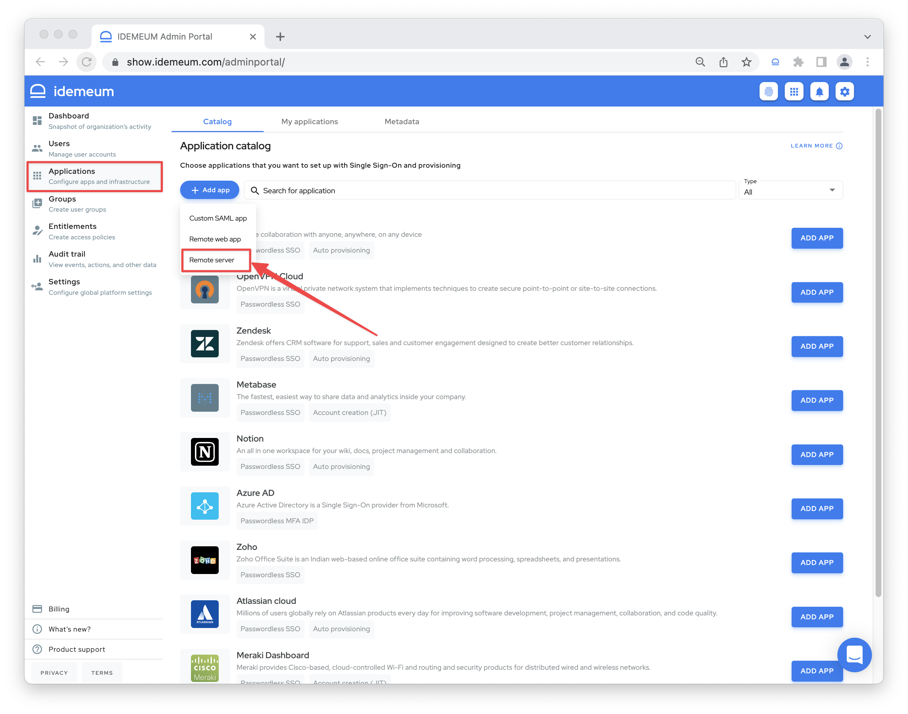
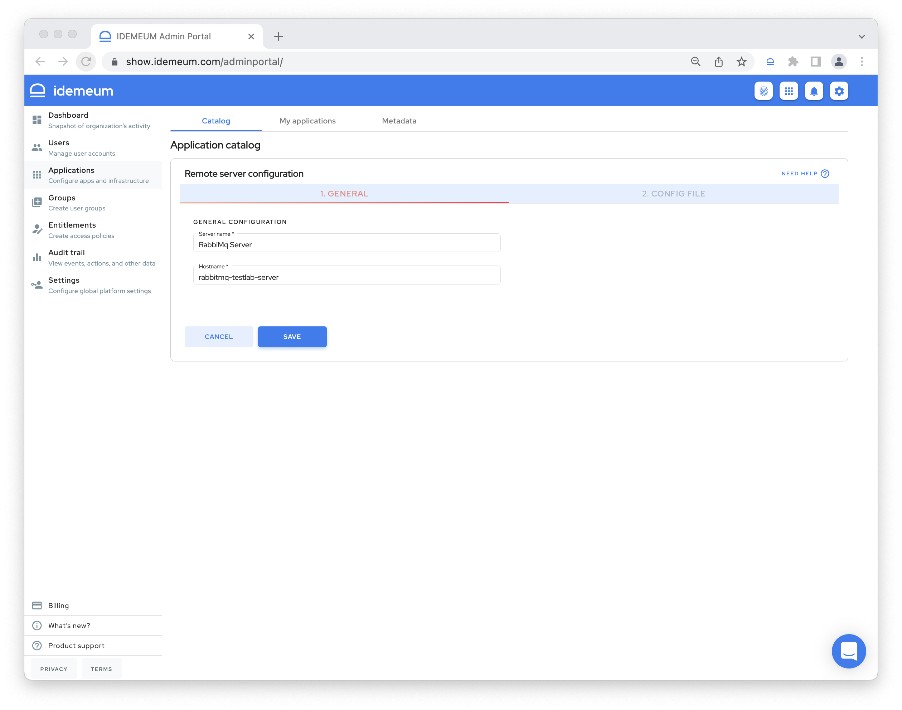
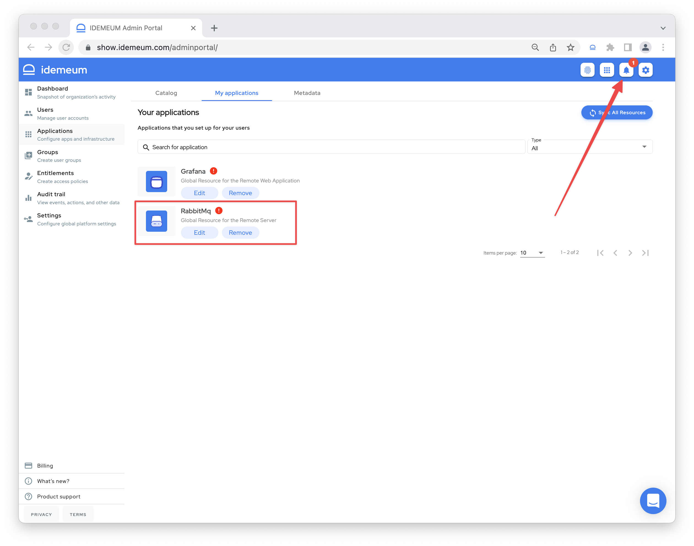
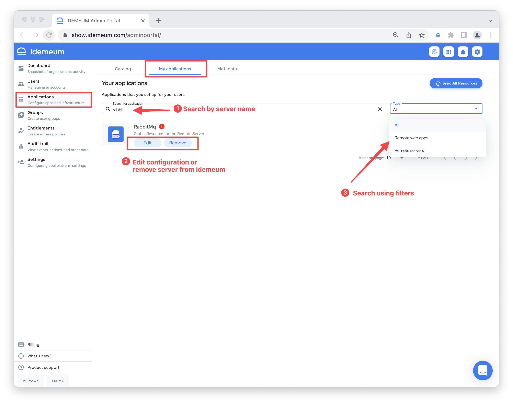
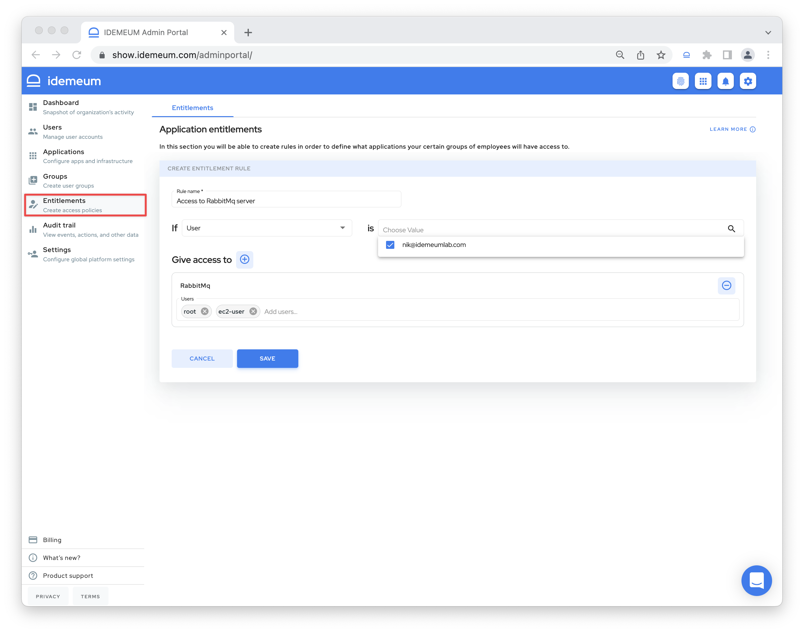
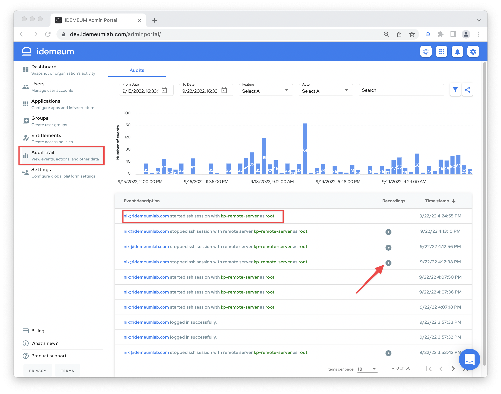

# Remote SSH server access

[[toc]]

## Overview

A `Remote Server` is any computer, physical or virtual, that runs Linux operating system, resides on a company's private network, and can be accessed over SSH protocol. One such example might be a RabbitMq messaging broker server that runs on a company's private network. The private network can be on-premises as well as in the cloud: AWS, Azure, Google Cloud etc.

## Prerequisites

::: warning Enable remote access infrastructure

Before integrating remote SSH servers with idemeum, make sure you [enable remote access](../remote-access/enable-remote-access.html) infrastructure, as it is not enabled by default.

:::

## Connect remote SSH server to idemeum

Let's assume that a company ACME, Inc has some infrastructure used for testing of an application and a part of this testing infrastructure is a RabbitMq messaging broker that is installed on a virtual machine running Linux operating system. This machine can be accessed over SSH protocol, but the users accessing it must be on the company's private network.

The administrator wants to allow some users to access the messaging broker server over the internet without forcing the users to use a VPN: a DevOps engineer who might be on call and off company's premises. The administrator also wants to control which users have access to the RabbitMq server: DevOps engineers and QA engineers should be able to access it, while the people in the Finance and Accounting should not be allowed access.

### Add a remote server

* Log into idemeum admin portal and navigate to `Applications`
* Click `Add app` button and choose `Remote server`

* On the `General` tab you will have to provide the following information:
	* **Server name** - server name that will appear on the end user portal. It can contain any characters up to a maximum of 256 chars.
	* **Hostname** - server name that will appear in the terminal when users access it over SSH. If the login username is `root` and the hostname is `rabbitmq-testlab-server` then on ssh console it will show `root@rabbitmq-testlab-server` so the user knows what server is using. It can contain only characters that are allowed in a domain: [a-z], [A-Z], 0-9 and '-' (dash) up to a maximum of 63 characters.  '-' (dash) cannot be the first character.

* Click `SAVE` to save the server configuration

### Install idemeum agent

* When you configured and saved SSH server in idemeum, the `Config File` tab will become active and will allow you to download both agent and required agent configuration file.

::: tip Detailed agent installation guide

* We documented detailed process to download and install agent in a separate document. 
* For remote SSH server an agent needs to be installed on the same machine you want to access with SSH.

[Download and install agent](../remote-access/install-agent.html)

:::

* When idemeum agent is not installed or not running correctly you will see a red exclamation mark on the `My applications` page. Moreover, admin will receive a notification in the notification tray.

* When agent is correctly installed the warnings will automatically go away.

## Manage SSH server

* Your server is accessible in the admin portal `My applications` section. You can directly search for it or use filters on the right and choose `Remote servers`.
* You can `Edit` server configuration or `Remove` server from idemeum. 

## Give access to SSH server

* In order for users to access remote SSH server you need to create an [entitlement rule](../application-entitlements.html) for the users or groups of users that should have access to it.
* Navigate to `Entitlements` and click `Add rule`

* In the example below I am directly entitling user `nik@idemeumlab` to access the RabbitMq server. You can also use groups to perform entitlement. 
* We have also configured what username(s) will be used when accessing the RabbitMq server. In the example above we have created 2 usernames: `root` and `ec2-user`. When launching the remote server application the user will select which username it wants to use for the connection to the RabbitMq server machine. This means that these usernames have to exist on the machine where the RabbitMq server is running.

::: tip More about groups and entitlements

You can learn more about how [groups](../group-management.html) and [entitlements](../application-entitlements.html) work in idemeum. 

:::

## Access SSH server
* You can launch remote servers in the same way you would access any other application - from **browser user portal**, from **extension**, and **mobile application**. 
* Once you click on the server tile, you will choose the `username` to login with, and the SSH terminal will open in the browser where you can manage your server. 

<iframe src='https://www.youtube.com/embed/NP-bg_xBzDo' frameborder='0' allowfullscreen></iframe>

## Audit events

* Access admin portal and navigate to `Audit trail` section
* You will be able to see detailed events for who accessed servers, what user names were used, and what the user was doing during terminal session.
* By clicking on the `recording icon`, the new tab will open and play the terminal recording session where you can see what the user was actually doing. 

