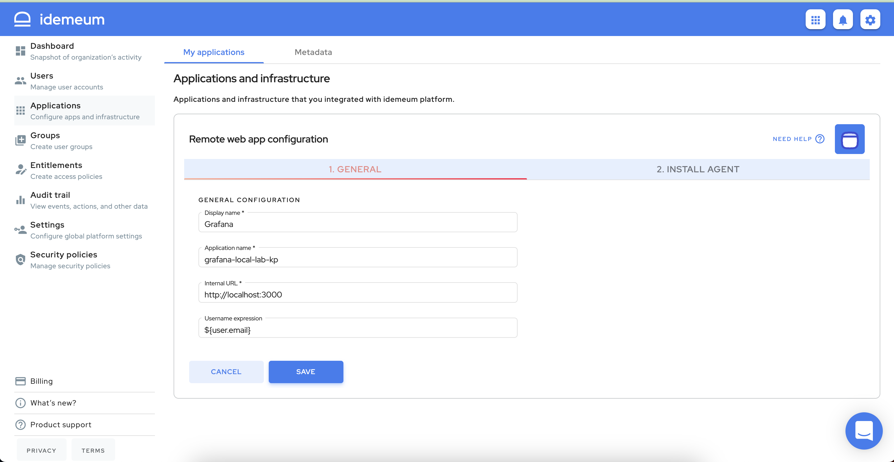

# Remote web application access

[[toc]]

## Overview

A `Remote Web Application` is any application that is served over HTTP protocol and resides on a private network. One such example might be a Jenkins application that runs on a company's private network. If a DevOps engineer wants to access the Jenkins web console, she must connect to the private network either using a VPN or being physically in the office. The private network can be on-premises or in the cloud: AWS, Azure, Google Cloud etc.

## Prerequisites

::: warning Enable remote access infrastructure

Before integrating remote web applications with idemeum, make sure you [enable remote access](../remote-access/enable-remote-access.html) infrastructure, as it is not enabled by default.

:::

## Connect remote web application to idemeum
Let's assume that a company ACME, Inc has some web application that should only be available on their private network. We will use the popular web application Grafana to build internal dashboards. When the DevOps engineers are on the company's private network they will access Grafana by going to this URL: `http://192.168.2.92:3000`.

The administrator wants to allow some users to access Grafana over the internet without having to use VPN: a DevOps engineer who might be on call and off company's premises.

### Add a remote web application
* Log into idemeum admin portal and navigate to `Applications`
* Click `Add app` button and choose `Remote web app`

* On the `General` tab you will have to provide the following information:
	* **Display name** - application name that will appear on the end user portal. It can contain any characters up to a maximum of 256 chars.
	* **Application Name** - this name will be part of the host name for accessing the application. Thus it can contain only characters that are allowed in a domain: [a-z], [A-Z], 0-9 and '-' (dash) up to a maximum of 63 characters.  '-' (dash) cannot be the first character.
	* **Internal URL** - this is the URL that idemeum will redirect the call once we authenticate and authorize that the user has access to the application. In our example this would be: `http://localhost:3000`. If the agent is not installed on the same application server, then you can use domain name or IP address to reach application on internal network.
	

* Click `SAVE` to save the application configuration

### Install idemeum agent

* When you configured and saved remote web application in idemeum, the `Config File` tab will become active and will allow you to download both agent and required agent configuration file.

::: tip Detailed agent installation guide

* We documented detailed process to download and install agent in a separate document. 
* For remote web application an agent can be installed on any internal server that can reach application server over http.

[Download and install agent](../remote-access/install-agent.html)

:::

* When idemeum agent is not installed or not running correctly you will see a red exclamation mark on the `My applications` page. Moreover, admin will receive a notification in the notification tray.

* When agent is correctly installed the warnings will automatically go away.

## Manage web application

* Your web application is accessible in the admin portal `My applications` section. You can directly search for it or use filters on the right and choose `Remote web apps`.
* You can `Edit` server configuration or `Remove` web application from idemeum. 

## Give access to remote web application

* In order for users to access remote web application you need to create an [entitlement rule](../application-entitlements.html) for the users or groups of users that should have access to it.
* Navigate to `Entitlements` and click `Add rule`

* In the example below I am directly entitling user `nik@idemeumlab` to access the Grafana application. You can also use groups to perform entitlement. 

::: tip More about groups and entitlements

You can learn more about how [groups](../group-management.html) and [entitlements](../application-entitlements.html) work in idemeum. 

:::

## Access remote web application

* You can launch remote servers in the same way you would access any other application - from **browser user portal**, from **extension**, and **mobile application**. 

## Authenticating users to remote application

Having an agent that builds an outbound tunnel to idemeum Proxy Service allows users to access remote web application with a simple click. However, when accessing these applications you need to pass user information to remote application as well, so user can log in into her account.

Today we support the following authentication methods:

|     Method        | Description |
| :----------------- |:-----------|
| Credentials autofill    | Automatically fill user credentials in the login form for remote web application           |

## Audit events
* Access admin portal and navigate to `Audit trail` section
* You will be able to see detailed events for who and when accessed remote applications

