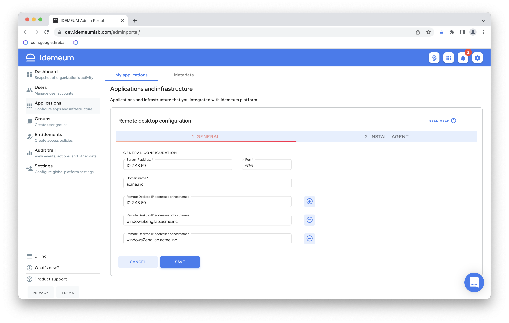

# Remote Windows Desktop access

[[toc]]

## Overview

A `Remote Windows Desktop` is any computer, physical or virtual, that runs Microsoft Windows operating system (Windows Server 2012 R2 / Windows 10 or newer), resides on a company's private network, and can be accessed over Remote Desktop Protocol (RDP). The private network can be on-premises as well as in the cloud: AWS, Azure, Google Cloud etc.

## Prerequisites

::: warning Enable remote access infrastructure

Before integrating remote Windows desktops with idemeum, make sure you [enable remote access](../remote-access/enable-remote-access.html) infrastructure, as it is not enabled by default.
:::

::: warning The remote Windows hosts have to be connected to an Active Directory domain.

:::

## Connect remote Windows desktop to idemeum

Let's assume that a company ACME, Inc is developing a Windows application and the developers need to make sure that the application can be installed successfully on Windows 10 and Windows 11 desktops. The ACME, Inc deployed a Windows 10 and a Windows 11 desktops that will be made available for developers and testing engineers to run some sanity tests before releasing the application to production. These desktops can be accessed over RDP protocol and are domain joined, but the users accessing it must be on the company's private network.

The administrator wants to allow some users to access these desktops over the internet without forcing the users to use a VPN: a quality assurance engineer who wants to run some tests but is off company's premises. The administrator also wants to control which users have access to these Windows desktops: developers and QA engineers should be able to access it, while the people in the Finance and Accounting should not be allowed access.

### Add a remote Windows desktop

* Log into idemeum admin portal and navigate to `Applications`
* Click `Add app` button and choose `Remote desktop`

* On the `General` tab you will have to provide the following information:
	* **Server IP address** - Your LDAP server IP address. It needs to support the LDAPS protocol.
  * **Port** - The LDAP server port number. The default LDAPS port number is 636.
  * **Domain Name** - Your domain controller domain name.
  * **Remote desktop IP address or hostnames** - The list of static IP addresses or hostnames of the remote desktops that you want to make available to your users. We are supporting IPv4 addresses. Hostnames have to be no more than 255 characters and it can contain only characters that are allowed in a domain: [a-z], [A-Z], 0-9 and '-' (dash).  '-' (dash) cannot be the first character.

* Click `SAVE` to save the desktop configuration

### Install idemeum agent

* When you configured and saved the remote desktop configuration in idemeum, the `Config File` tab will become active and will allow you to download both agent and required agent configuration file.

::: tip Detailed agent installation guide

* We documented detailed process to download and install agent in a separate document.
* For remote desktop the agent needs to be installed on a linux machine.

[Download and install agent](../remote-access/install-agent.html)

:::

* When a remote Windows desktop is inavtivated you will see a red exclamation mark on the `My applications` page. Moreover, admin will receive a notification in the notification tray.

* When the remote desktop is activated back the warnings will automatically go away. A desktop should only become inactive if the windows agent is down, so please check that your windows agent is up and running.

## Manage Windows Remote desktop configuration

* Your configuration for the Remote Windows is accessible in the admin portal `My applications` section. On the desktop configuration card information there will also be displayed the total number of active desktops that were synced by that configuration.
* You can `Edit` or `Remove` the desktop configuration from idemeum. When you remove a desktop configuration, all the desktops that were synced by that configuration will also be deleted and will not be available to the users that had entitlements to those desktops.

## Give access to Windows desktops
* You will first have to install the Windows agent so idemeum can sync the desktops from your domain controller. See details on how to install the idemeum agent.
* Once the remote desktops are synced to idemeum, then you need to create an [entitlement rule](../application-entitlements.html) for the users or groups of users that should have access to them.
* Navigate to `Entitlements` and click `Add rule`

* In the example below I am directly entitling user `nik@idemeumlab.com` to access the remote desktop with IP address 10.2.48.69. You can also use groups to perform entitlement.
* We have also configured what username(s) will be used when accessing the remote desktop. In the example above we allow Nik user to log in using 2 accounts: `Administrator` and `idemeum`. When launching the remote Windows desktop application the user will select which username it wants to use for the connection to the Windows machine. This means that these usernames have to exist on the Domain Controller since these cannot be local user accounts but Active Directory accounts.

::: tip More about groups and entitlements

You can learn more about how [groups](../group-management.html) and [entitlements](../application-entitlements.html) work in idemeum.

:::

## Access Windows desktops
* You can launch Windows desktops in the same way you would access any other application - from **browser user portal**, from **extension**, and **mobile application**.
* Once you click on the remote desktop tile, you will choose the `username` to login with, and the remote desktop session will open in the browser.

TODO: Add the recording to the launching of a remote desktop

<iframe src='https://www.youtube.com/embed/NP-bg_xBzDo' frameborder='0' allowfullscreen></iframe>

## Audit events

* Access admin portal and navigate to `Audit trail` section
* You will be able to see detailed events for who accessed the Windows desktops and what user names were used.

