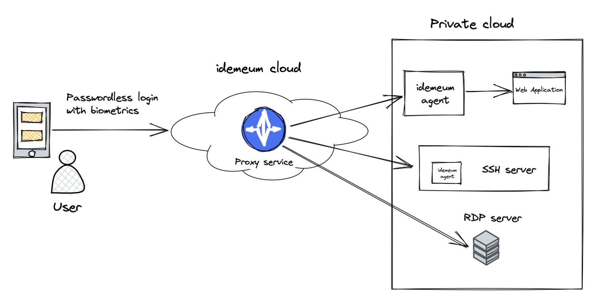
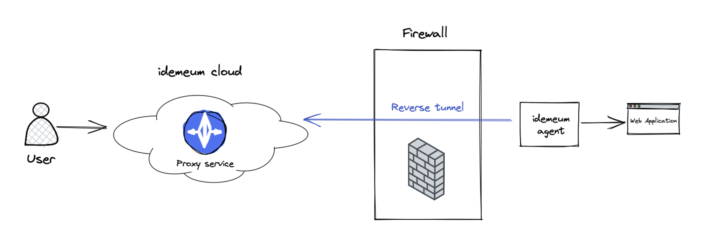

# Secure Remote Access
[[toc]]

## Overview

::: tip What is Secure Remote Access?

idemeum offers cloud proxy to access your infrastructure and private cloud applications. By using idemeum Remote Access you can:

* Replace your legacy VPN and centralize passwordless access to all on-premises resources including web applications, SSH servers, and RDP desktops
* Eliminate passwords and replace them with short-lived certificates
* Enforce access policies to give your employees access to only what they need

:::

Secure Remote Access offers end to end user experience:

* ***Connects*** employees to resources without exposing any ports or network changes
* ***Authenticates*** users with [Passwordless MFA](../mfa-overview.html)
* ***Authorizes*** access based on granular policies
* ***Audits*** each user session and captures terminal recordings

## Core components

### Proxy Service
Proxy Service allows employees to access on-premises company resources from public network. It is identity aware proxy, meaning it makes sure only authenticated clients can connect to company on-premises resources. Proxy Service intercepts multiple protocols, including HTTP, SSH, and RDP traffic.

Proxy Service carries out additional functionality including issuing short-lived client certificates to users and collecting audit and session recording information. 

### Agent

Agent allows you to seamlessly connect to on-premises resources without exposing any ports or changing network configuration. It established a reverse tunnel back to idemeum Proxy Service, which in turn will forward client connections to target resources over these tunnels.

Additionally agent carries out the following functionality: 

* Provides automatic registration with proxy service to simplify integration set up
* Records terminal sessions
* Replaces OpenSSH daemons to connect to SSH servers using short lived certificates

## How it works

### Connectivity

When you configure remote application or server in idemeum, you have an option to download idemeum agent and associated configuration file. When you install idemeum agent in your private cloud, it will automatically register with proxy service receiving its own certificate. Reverse tunnel will be established back to proxy service, and no opening ports or network configuration changes required. Once registration is complete, users can start accessing remote resources through established reverse tunnel. 

### Authentication

Authentication is about proving an identity of a user.

When a user is accessing company application or resource, the first thing that needs to happen is Multi-Factor Authentication with idemeum [Passwordless MFA](../mfa-overview.html). User will need to approve login with biometrics and perform FIDO-based authentication with certificates stored in a mobile device hardware backed storage. You can learn more about how Passwordless MFA works in our [security paper](../security-whitepaper.html). 

Once a session is established with idemeum, an [X.509](https://en.wikipedia.org/wiki/X.509) short-lived certificate is issued for a user. Certificates are tied to a user identity, and every connection to a server or application with idemeum Remote Access will require authentication with this certificate. Thereby, idemeum eliminates passwords and static credentials. User certificates are short-lived and will expire automatically without any management required. 

### Authorization

Authorization is about giving access rights to a resource.

With idemeum everything is denied by default following [least privilege principle](https://en.wikipedia.org/wiki/Principle_of_least_privilege). After successful authentication we evaluate admin-defined policies to assign users resources that they are entitled to. 
Admins can define fine-grained policy rules to allow access to specific applications and servers based on various attributes, such as user roles, principals, and more.

### Audit

idemeum captures detailed logs of who is accessing what resources in your environment. A detailed audit log trail is maintained for all applications and resources. What is more, idemeum agents capture terminal session recordings, so that you can review a video recording of what users are doing when they are connecting to infrastructure resources.