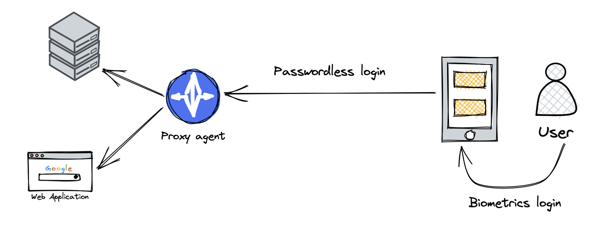

# Secure Remote Access overview

What is more idemeum offers a proxy agent to connect to your infrastructure asserts without passwords - on-premises applications, SSH servers, RDP workstations, and databases. When proxy agent is installed, no ports need to be exposed in order to reach the resource, as proxy agent is utilizing the outbound channel to connect to idemeum cloud. 

::: warning Early access

This feature is in early access.

Please, contact us for more details at [support@idemeum.com](mailto:support@idemeum.com)

:::