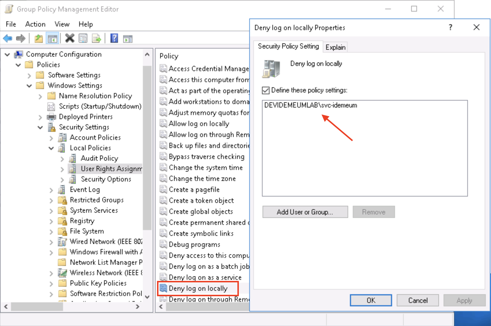
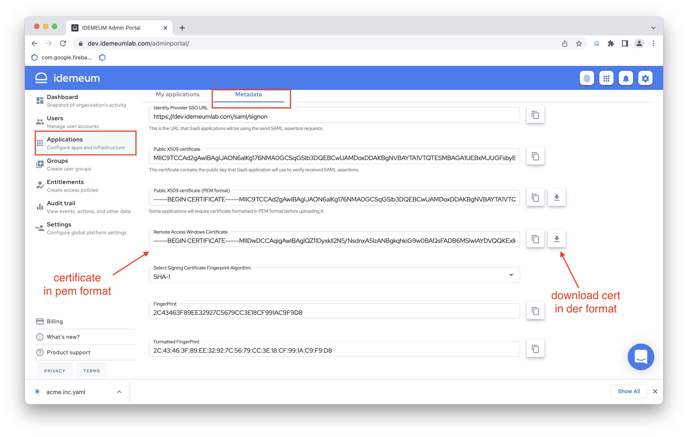
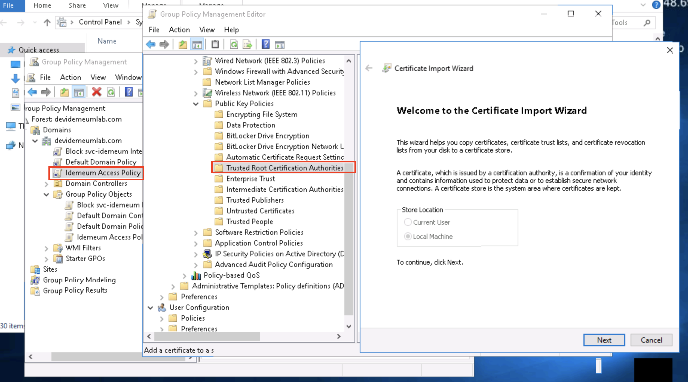
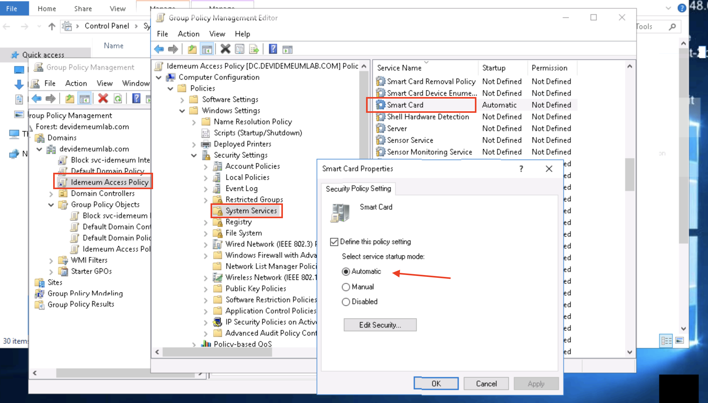
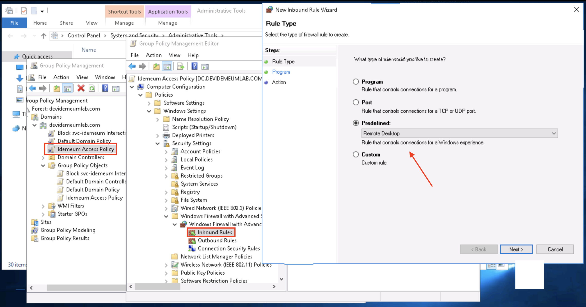

# Domain Controller Configuration for Remote Desktop Support

[[toc]]

## Overview

In order to use idemeum for passwordless access to remote desktops in your private network there are few things that need to be configured on your Domain Controller server.

## Prerequisites

::: warning Remote Desktops need to be connected to an Active Directory domain

* idemeum can only provide remote access to Windows desktops that are connected to an Active Directory domain. The Active Directory domain should be configured for LDAPS connections.
* In order to support the LDAPS connections you need to configure the [AD CS](https://learn.microsoft.com/en-us/windows-server/identity/ad-cs/). The Windows server that is running the Certificate Authority has to have Trusted Platform Module (TPM) support.
* The supported Windows versions are: Windows Server 2012 R2 / Windows 10 or newer
:::

## Active Directory Configuration

### Setup Active Directory
If you already have an active directory setup you can skip to the next step. If you are setting up a fresh Active Directory domain the on the Windows server where you want to install the Active Directory run the following Powershell script. The Windows Server has to have TPM support.

In the script below please set the **domain** variable to your domain name.

``` powershell
$ErrorActionPreference = "Stop"

$domain = 'idemeumdemo.com'
$netbiosDomain = ($domain -split '\.')[0].ToUpperInvariant()

echo 'Installing the AD services and administration tools...'
Install-WindowsFeature AD-Domain-Services,RSAT-AD-AdminCenter,RSAT-ADDS-Tools

echo 'Installing AD DS (be patient, this may take a while to install)...'
Import-Module ADDSDeployment
Install-ADDSForest `
    -InstallDns `
    -CreateDnsDelegation:$false `
    -ForestMode 'Default' `
    -DomainMode 'Default' `
    -DomainName $domain `
    -DomainNetbiosName $netbiosDomain `
    -SafeModeAdministratorPassword (Read-Host "Enter Your Password" -AsSecureString) `
    -NoRebootOnCompletion `
    -Force

Restart-Computer -Force
```

### Enable Active Directory Certificate Authority
In order to enable the Certificate Authority you need to run the following powershell script

``` powershell
$ErrorActionPreference = "Stop"

Add-WindowsFeature Adcs-Cert-Authority -IncludeManagementTools
Install-AdcsCertificationAuthority -CAType EnterpriseRootCA -HashAlgorithmName SHA384 -Force
Restart-Computer -Force
```

### Create a restrictive service account
Idemeum requires a service account to connect to your Active Directory domain. We recommend creating a dedicated service account with restrictive permissions for maximum security.

To create the service account, open a PowerShell prompt and copy-paste in the commands below. **A password for this service account will be randomly generated, but immediately discarded. Idemeum does not need this password,** as it uses x509 certificates for LDAP authentication. You can reset the password for this account should you need to perform password authentication.

``` powershell
#Creates an idemeum service account
$Name="Idemeum Service Account"
$SamAccountName="svc-idemeum"

# Generate a random password that meets the "Password must meet complexity requirements" security policy setting.
# Note: if the minimum complexity requirements have been changed from the Windows default, this part of the script may need to be modified.
Add-Type -AssemblyName 'System.Web'
do {
   $Password=[System.Web.Security.Membership]::GeneratePassword(15,1)
} until ($Password -match '\d')
$SecureStringPassword=ConvertTo-SecureString $Password -AsPlainText -Force

New-ADUser `
  -Name $Name `
  -SamAccountName $SamAccountName `
  -AccountPassword $SecureStringPassword `
  -Enabled $true


#Now limit the service account's permission
# Save your domain's distinguished name to a variable.
$DomainDN=$((Get-ADDomain).DistinguishedName)

# Create the CDP/Idemeum container.
# If the command fails with "New-ADObject : An attempt was made to add an object to the directory with a name that is already in use",
# it means the object already exists and you can move on to the next step.
New-ADObject -Name "Idemeum" -Type "container" -Path "CN=CDP,CN=Public Key Services,CN=Services,CN=Configuration,$DomainDN"

# Gives Idemeum the ability to create LDAP containers in the CDP container.
dsacls "CN=CDP,CN=Public Key Services,CN=Services,CN=Configuration,$DomainDN" /I:T /G "$($SamAccountName):CC;container;"
# Gives Idemeum the ability to create and delete cRLDistributionPoint objects in the CDP/Idemeum container.
dsacls "CN=Idemeum,CN=CDP,CN=Public Key Services,CN=Services,CN=Configuration,$DomainDN" /I:T /G "$($SamAccountName):CCDC;cRLDistributionPoint;"
# Gives Idemeum the ability to write the certificateRevocationList property in the CDP/Idemeum container.
dsacls "CN=Idemeum,CN=CDP,CN=Public Key Services,CN=Services,CN=Configuration,$DomainDN " /I:T /G "$($SamAccountName):WP;certificateRevocationList;"
# Gives Idemeum the ability to create and delete certificationAuthority objects in the NTAuthCertificates container.
dsacls "CN=NTAuthCertificates,CN=Public Key Services,CN=Services,CN=Configuration,$DomainDN" /I:T /G "$($SamAccountName):CCDC;certificationAuthority;"
# Gives Idemeum the ability to write the cACertificate property in the NTAuthCertificates container.
dsacls "CN=NTAuthCertificates,CN=Public Key Services,CN=Services,CN=Configuration,$DomainDN" /I:T /G "$($SamAccountName):WP;cACertificate;"
```

#### Do not allow interactive login for idemeum service account
The Idemeum service account is only needed to authenticate over LDAP. We should not allow interactive login using this account, like your regular users. In order to restrict the interactive login we need to create a new Group Policy Object (GPO) linked to your entire domain, and then deny it interactive login.

**Step 1**: Create the Group Policy object

Open a PowerShell prompt and change the $GPOName variable below to your desired GPO name, or leave the recommended name:

``` powershell
$GPOName="Block svc-idemeum Interactive Login"
# Create the new GPO and link with target domain
New-GPO -Name $GPOName | New-GPLink -Target $((Get-ADDomain).DistinguishedName)
```

**Step 2**: Deny Interactive Login

1. Open the program named `Group Policy Management` and find the GPO you just created (`$FOREST > Domains > $DOMAIN > Group Policy Objects > Block idemeum-svc Interactive Login`), right-click on it and select `Edit...` from the context menu.
2. Select: `Computer Configuration > Policies > Windows Settings > Security Settings > Local Policies > User Rights Assignment`
3. Double click `Deny log on locally` and in the popup, check `Define these policy settings`.
4. Then click `Add User or Group...`, `Browse ...`, enter the SAM account name of the user you created above (`svc-idemeum`) and hit `Check Names` select your Group, and then hit `OK` on all the windows.
5. Repeat steps 3 and 4 for `Deny log on through Remote Desktop Services` (in lieu of `Deny log on locally`).



::: warning Disable username/password Authentication
For added security, consider disabling username/password authentication completely via the GPO, requiring access via idemeum’s remote access virtual smart card.
:::

### Allow connections from idemeum
We need to configure Active Directory to accept and allow remote desktop connections from idemeum. This includes telling your computers to trust Idemeum CA, allowing the certificate-based smart card authentication, and ensuring RDP is enabled.

**Step 1** : Export Idemeum certificate

As an admin login to the Admin portal and from Applications -> Metadata page you can download the idemeum Remote Access certificate on your Windows machine. You can click the download button and download it in der format or copy it as a pem format and use an online tool to convert it to a der format.



**Step 2** : Create a new GPO with Idemeum as Root CA

Open a powershell editor and run the following script:
```
$GPOName="Idemeum Access Policy"
New-GPO -Name $GPOName | New-GPLink -Target $((Get-ADDomain).DistinguishedName)
```

1. Open the `Group Policy Management` application, and on the left pane, navigate to `$FOREST > Domains > $DOMAIN > Group Policy Objects`.
2. Right click on the GPO you just made (`Idemeum Access Policy`), and select `Edit...`.
3. In the group policy editor, select:

`Computer Configuration > Policies > Windows Settings > Security Settings > Public Key Policies`

1. Right click on `Trusted Root Certification Authorities` and select `Import`.
2. Click through the wizard, selecting the certificate file in the der format that you downloaded from idemeum admin portal



**Step 3**: Publish the Idemeum CA to the Active Directory domain

On a machine which is joined to your domain and logged in as an account in the `Domain Administrators` group, run the two commands below at a PowerShell prompt to publish the Idemeum CA to your Active Directory domain (PathToCertFile.der is the path to where you have locally saved the Idemeum certificate):

```
certutil –dspublish –f <PathToCertFile.der> RootCA
```

This step enables the domain controllers to trust the Idemeum CA, which will allow smart card logons via Idemeum to succeed.

::: warning For AWS Active directory
When using AWS Managed Active Directory, you should run the command above using an account which is part of the AWS Delegated Domain Administrators group, such as the AWS-provided admin account.
:::

**Step 4**: Publish the Idemeum CA to the NTAuth Store

In order for authentication with idemeum-issued certificates to succeed, the Idemeum CA needs to be published to the enterprise NTAuth store. Idemeum will periodically publish its CA after it is able to authenticate, but this step needs to be performed manually the first time in order for Idemeum to have LDAP access.

Open powershell and run the following script.
```
certutil –dspublish –f <PathToCertFile.der> NTAuthCA
#Force the retrieval of the CA from LDAP. While this step is not required, it speeds up the process and allows you to proceed to the next steps without waiting for the certificate to propagate.
certutil -pulse
```

### Enable Smart Card service

Idemeum performs certificate based authentication by emulating a smart card.

1. Open the Group Policy Management application and edit your `Idemeum Access Policy`.
2. Select `Computer Configuration > Policies > Windows Settings > Security Settings > System Services`
3. Double click on `Smart Card`, select `Define this policy setting` and switch to `Automatic` then click `OK`.



### Open firewall to inbound RDP connections

1. Open Group Policy Management and select the `Idemeum Access Policy`.
2. Select `Computer Configuration > Policies > Windows Settings > Security Settings > Windows Firewall with Advanced Security (x2)`
2. Right click on `Inbound Rules` and select `New Rule...`.
3. Under `Predefined` select `Remote Desktop`.
4. Only select the rule for `User Mode (TCP-in)`.
5. On the next screen, select `Allow the connection` and finish.



### Allow remote RDP connections
1. Open Group Policy Management and select the `Idemeum Access Policy`.
2. Select `Computer Configuration > Policies > Administrative Templates > Windows Components > Remote Desktop Services > Remote Desktop Session Host > Connections`
3. Right click on `Allow users to connect remotely by using Remote Desktop Services` and select `Edit`. Select `Enabled` and `OK`.
4. Select:`Computer Configuration > Policies > Administrative Templates > Windows Components > Remote Desktop Services > Remote Desktop Session Host > Security`
5. Right click `Require user authentication for remote connections by using Network Level Authentication`, edit, select **`Disable`** and `OK`.

### Ensure your GPO is updated
Since we did modify the GPO ensure that all the changes are in effect by running the following script in powershell

```
gpupdate.exe /force
```
