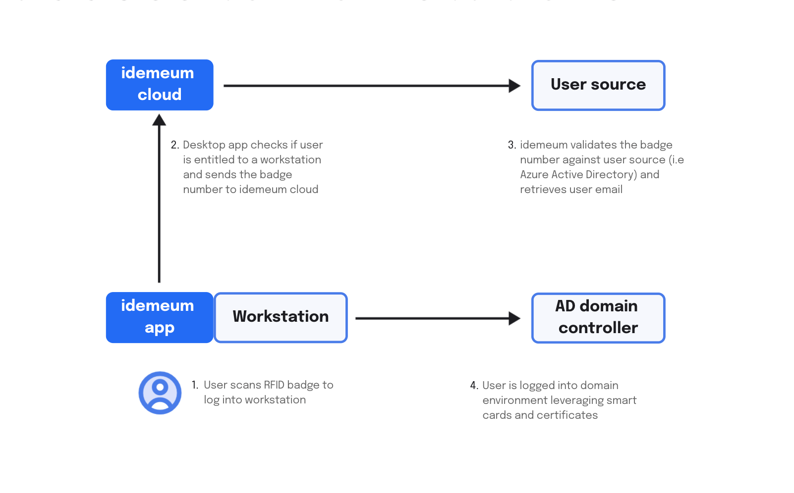

# RFID Access Architecture

## Overview

::: tip What is supported?

Today we support Active Directory domain-joined Windows computers. If you have a different environment or need us to support different integrations you can always contact us at [support@idemeum.com](mailto:support@idemeum.com), and we will be happy to help you with a custom design.

:::

### Major components

There're several major components that will make passwordless login with RFID card possible:

- **idemeum desktop application** - idemeum application will need to be installed on every workstation. Once installed and paired with idemeum cloud tenant, idemeum application will register as credential provider on Windows and will stat processing all login requests with RFID card.
- **idemeum cloud** - idemeum cloud will serve as a management plane for RFID access, where you can manage users, workstations, as well as entitlements to define who has access to what. 
- **User source** - idemeum will need to have access to user source where the mapping between badge number (encoded on RFID card) and employee corporate email address is maintained. When the badge is scanned, idemeum desktop application will receive badge number, and then it needs to find the corporate email address of the user associated with that badge number. 
- **Domain controller** - idemeum desktop application will generate a virtual smart card for each user, and will use that smart card to log employee into domain environment without passwords.

### User login flow

Here is the generic user login flow that is performed when the RFID badge is scanned. 

1. User taps the RFID badge on the badge reader that is connected to a Windows computer over USB port. idemeum desktop application is integrated with the reader, it detects badge tap event and is able to extract that badge number.
2. idemeum desktop application communicates with the idemeum tenant that it is registered with, submits the badge number for user look up, and conducts the entitlement check to see if the user has permission to access workstation.
3. idemeum cloud connects to user source to validate the badge number and look up user corporate email address that will be used to login into a domain environment. 
4. Once the user email is found, it is passed back to idemeum desktop application that in turn generates virtual smart card for the user and uses that smart card to log the user into a domain-joined workstation. 

