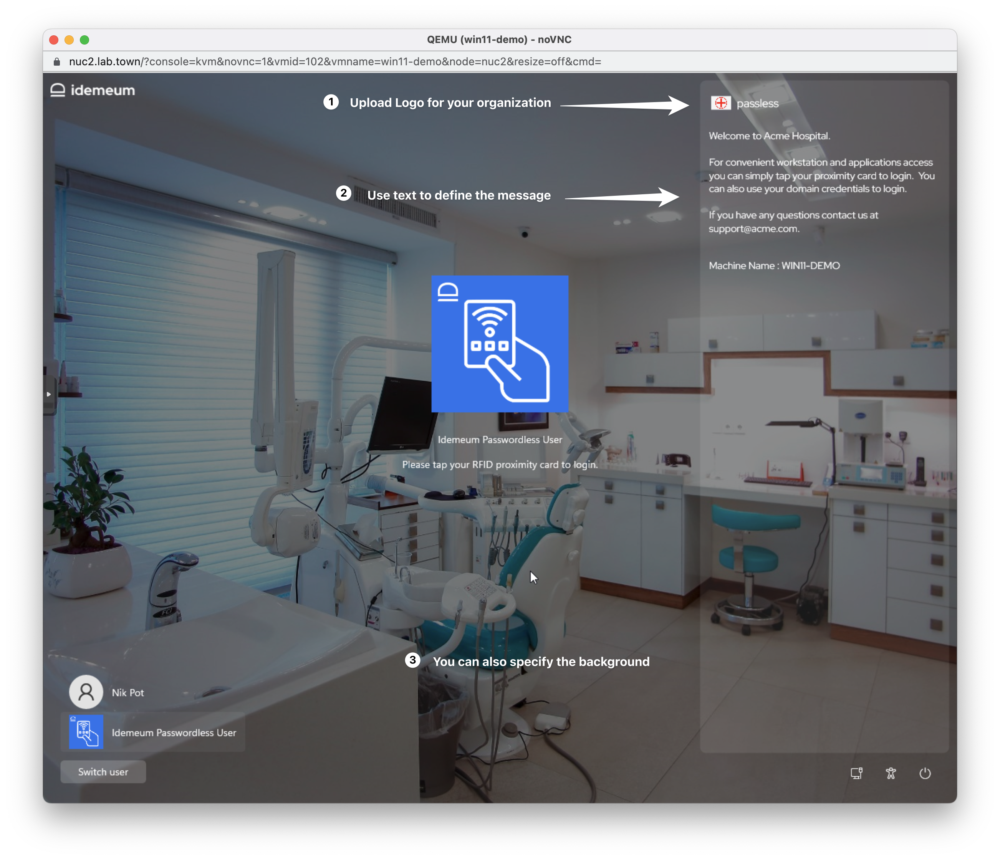
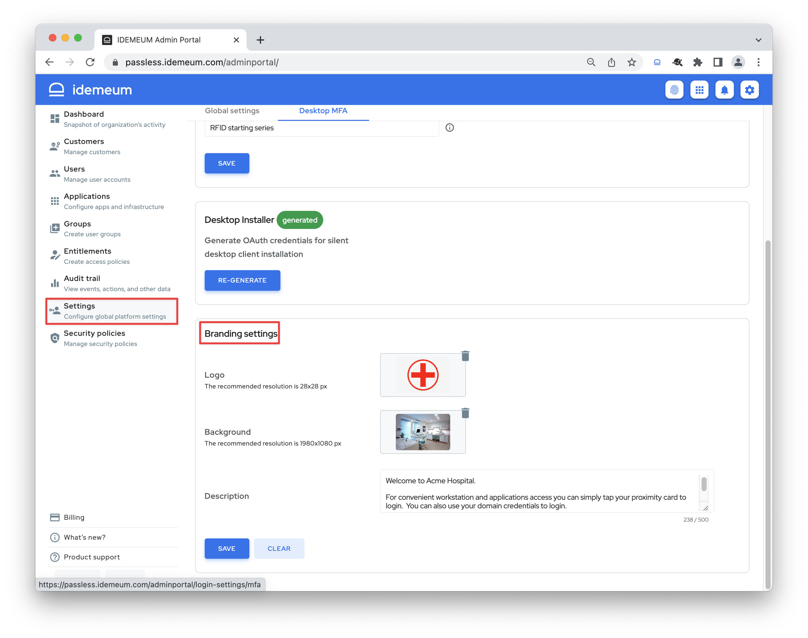

# RFID login branding

## Overview

When you install idemeum desktop application it takes over the login screen. In order for the application to reflect your branding images and logo, idemeum allows you to customize the login screen.

There are several options available for customization: 

1. **Company logo** - you can upload company logo image and it will be displayed at the top right of the screen. The recommended image is 28px by 28px. 
2. **Desktop background** - you can upload the image that will be used as a background for the login screen. The recommended resolution is 1980x1080 px.
3. **Description text** - you can specify any message that will be displayed to the user on the right side of the screen. The maximum size of the text is 500 characters. 

## Configure branding

* Access idemeum admin portal
* Navigate to `Settings` -> `Desktop MFA`
* Scroll down to `Branding settings`

* You can now upload logo and background images, and specify the text to be displayed on the login screen
* Click `Save`

::: warning Time to update branding settings
* Once you update the branding settings, existing app installations **will take up to 6 hours to reflect changes**. If you wish to update the settings manually, navigate to workstation, open idemeum desktop application, and click `Update settings` to retrieve setting manually. 
* New app installations will reflect branding right away. 

:::