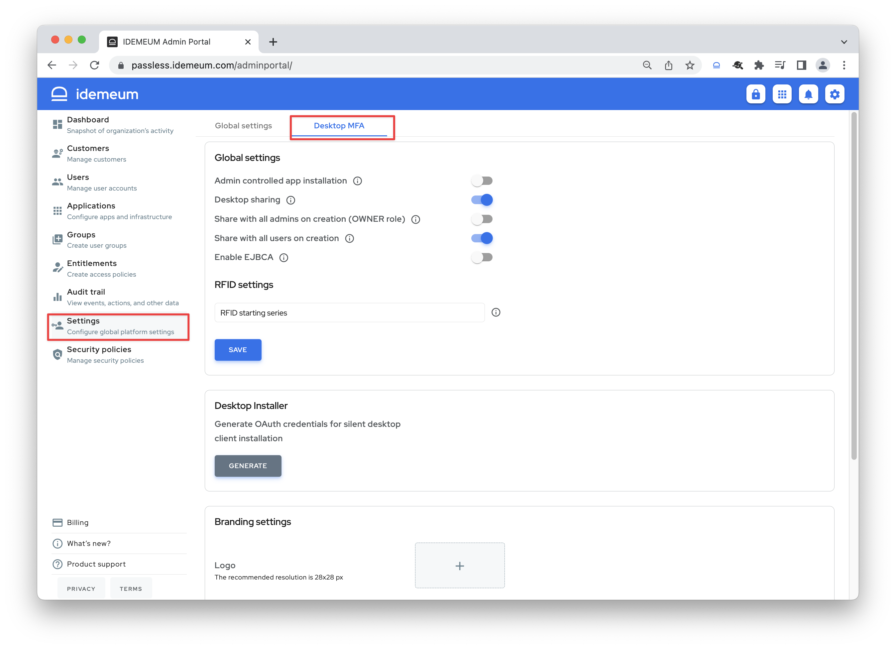

# RFID cloud settings

## Overview

idemeum allows you to configure various RFID settings in the idemeum [admin portal](../user-and-admin-portals.html#access-admin-portal). 

* Access your idemeum admin portal and navigate to `Settings` -> `Desktop MFA`

Here is the list of settings available to you:

* **Admin controlled app installation** - if this setting is enabled, only workstation admins can install idemeum desktop client. If a user does not have admin permissions, she will not be able to install idemeum client. 
* **Desktop sharing** - when a desktop is installed it is assigned to a user who installed it. This option will allow users to share desktops with other users (applies to RFID and QR-code mode for desktop application).
* **Share with all admins on creation** - when the application is installed it will be shared with all idemeum admins, so that every idemeum admin can configure application in the user portal.
* **Share with all users on creation** - this setting will allow any idemeum user to access the desktop application when it is installed.
* **Enable EJBCA** - we support integration with external CA for virtual smart card geenration. This option allows for integration with EJBCA for certificate enrollment. 
* **RFID starting series** - this option allows to specify comma-separated badge starting series to allow for login. For example, say you specify `30,4`, then if you tap the badge that starts with `5`, that login request will be ignored.
* **oAuth credentials** - you can generate oAuth client id and secret to use silent installation of idemeum desktop client. For example, you can use [PDQ deploy](https://integrations.idemeum.com/windows-desktop-mfa-silent-installer-via-pdq-deploy/) to push idemeum client to all Windows domain joined machines.
* **Branding** - you can set up branding options for idemeum desktop client to display on the login screen.

## Setting retrieval

When you adjust some of these settings (i.e RFID series or branding), they will not take immediate effect. Here is how idemeum desktop application will retrieve these settings:

1. **Automatically** - every 6 hours idemeum desktop client will contact idemeum cloud and pull the settings that have been updated. 
2. **Manually** - you can force idemeum client to update the settings right away. Access each desktop client on the workstation, launch it, and click `Update settings` at the top right corner.