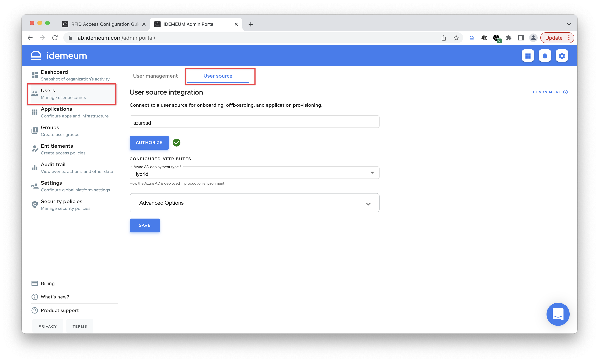
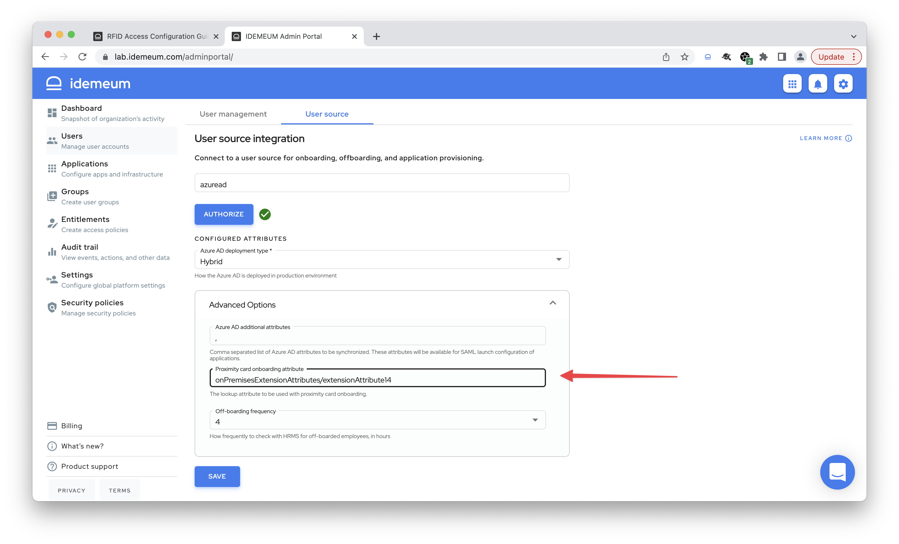

# RFID Access Configuration Guide

[[toc]]

## 1. Configure RFID readers

As a first step you need to configure each of your RFID readers. At the very least you will need to set up how the badge number is formatted and passed for user corporate email look up. 

::: tip How to configure readers

Follow the steps documented [here](./rfid-readers.html#configuring-rfid-number-format) to set up badge number formatting. 

Once the badge is tapped, reader extracts the badge number and passes it to idemeum desktop client. idemeum client will convert the number in digital format and will perform a user lookup in your directory in order to extract a corporate email address the scanned badge number. Therefore the badge number format passed by the reader needs to match the badge number format that you are using in your directory.

:::

## 2. Connect to user source

In this step you will integrate your idemeum tenant with your user source where a badge lookup will be performed. Today idemeum supports a number of user sources. You can check our integration portal for the latest [integration documents](https://integrations.idemeum.com/tag/user-source/). 

Let's see the example of how you can use Azure Active Directory as a user source for badge numbers and user data. 

- Navigate to your idemeum tenant admin portal
- Navigate to `Users` -> `User source`

- From the drop down menu choose `azuread`
- Click `Authorize`, the new pop up window will open. Enter Azure AD admin credentials and allow idemeum access to user data for corporate email address look up and user onboarding.
- Choose `Hybrid` for deployment type
- Expand `Advanced options`

* Choose the Azure AD attribute where the badge number is stored. For example, if you are using Exchange extension attributes you can use `onPremisesExtensionAttributes/extensionAttribute14` to access extension attribute number 14
* Click `Save`

## 3. Integrate with domain controller

Once the badge is scanned, badge number is extracted and used to look up corporate email address in the user source. Once corporate email address is found, a virtual smart card is generated to log the user into domain-joined machine. 

In order for domain controller to trust certificates generated by idemeum desktop client, you need to set up certificate template on your domain controller. This is a one time configuration. 

::: tip How to set up Active directory integration

Follow the following guide to perform Active Directory certificate services set up - [Windows Desktop MFA - AD CS configuration](https://integrations.idemeum.com/windows-desktop-login-mfa-adcs-configuration/)

:::

::: warning User matching

When idemeum generates virtual smart card and logs the user into domain workstation, the corporate email address that is extracted from user source need to match either `user logon name` or `email address` in Active Directory user record.

:::

## 4. Install desktop clients

You can now install idemeum desktop client on each workstation that you want to secure with RFID access. 

::: tip How to install idemeum desktop client?

We have documented detailed steps for how to install idemeum desktop client - [Windows Desktop MFA - domain joined machines](https://integrations.idemeum.com/windows-installation-guide-for-domain-joined/)

:::

## 5. Test login flows

You can now test the login flow. Simply scan the RFID badge for the employee, and idemeum desktop client will try to look up the user email in the user source, and then log the user into workstation with virtual smart card. 

::: tip User login flows

We have documented all user login flows that we support here - [Supported login flows](./rfid-supported-flows.html).

:::

If you have any questions or issue, please contact us at [support@idemeum.com](mailto:support@idemeum.com). 
