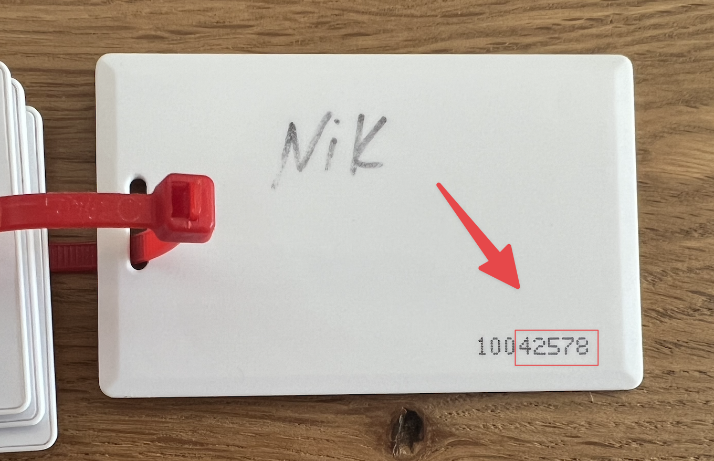

# RFID readers

[[toc]]

## Overview

Today we partner with [rf IDEAS](https://www.rfideas.com/), a company that manufactures RFID readers and devices. rf IDEAS has been in business for 25+ years, supports 40 countries with global team and channel partners, and offers a wide portfolio of RFID readers. 

idemeum integrates with rf IDEAS sensors using [SDK](https://www.rfideas.com/products/tools-utilities/software-development-kits/universal-enroll-sdk), and we can support a wide variety of readers depending on your use cases. For example, one of the most popular readers is [Wave ID Mini Plus](https://www.rfideas.com/products/readers/dual-frequency/wave-id-plus-mini). It offers great balance between price, variety of features and cards supported, and a small compact form factor.

::: tip Additional questions?

if you have any questions, or want us to explore integration with other reader manufactures, contact us at [support@idemeum.com](mailto:support@idemeum.com).

:::

## Reader configuration

Before you can use the rf IDEAS readers, they need to configured for your environment. rf IDEAS provides a configuration utility that can be used to set up readers and required parameters. You can access configuration utility [here](https://www.rfideas.com/support/tools/downloads). 

With this configuration utility you can set up various reader parameters, such as what cards the reader will recognize, how the RFID badge number will be formatted, the volume of the reader beeper, color of LED and more. Click on three lines menu at the top right, then `Help` -> `Read user manual` to learn more about all configuration options. 

### Configuring RFID number format

One of the required configurations is to set up the formatting for the RFID badge number. Navigate to `Format` section in the configuration utility to set up format configuration. 

- You will need to define how many leading and trailing bits you want to strip, and whether you would want to send the facility code. This configuration will depend on how you are storing the employee badge number in your systems. 
- Once the badge is scanned and passed to idemeum desktop client, it will [look up the user email address](/rfid/rfid-architecture.html) by badge id in your user source. Therefore, for a successful match, the formatting set up on the reader needs to match the format of how you store the badge numbers for your employees.

::: tip Reader configuration example

Let's say I am using the standard 26-bit RFID proximity card.

- That means that the number encoded on the card will be represented by 26 bits in hexadecimal format - `00 00 00 00 00 02 C9 4C A4`
- Once the number is read by the reader and passed to idemeum desktop client it will be converted to decimal format -  `46746788`
- To apply standard formatting we will strip 9 leading bits, and 2 trailing bits. Hexadecimal format will be `00 00 00 00 00 00 A6 52`, and the decimal number will become `42578`
- This is the exact number that is written on the back of a standard RFID card.

Depending on how you store the badge numbers for your employees, you can configure the bit stripping and manipulation appropriately.
:::