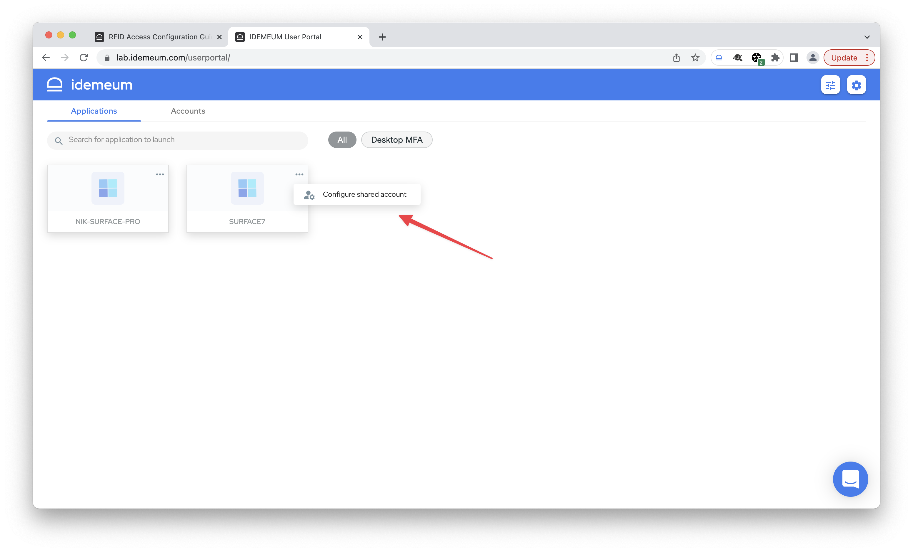
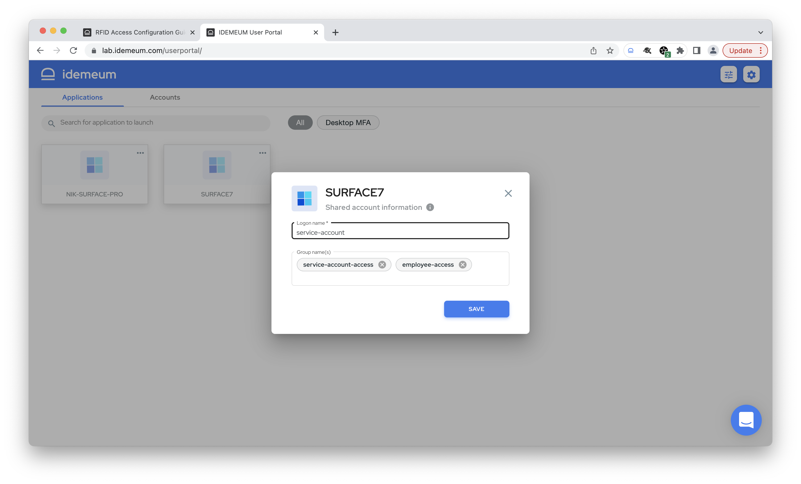

# Shared Account Login

[[toc]]

## Overview

With idemeum you can assign a shared account to a workstation, and everyone who will access this workstation with RFID badge will be signed in with that shared account. 

For example, let's say there is a Windows workstation where everyone needs to log into with a shared account `service-account`. idemeum allows assigning this `service-account` to a workstation, and then controlling who has access to this workstation with user groups. Anyone who has access and scans the RFID badge will be logged into a machine with a `service-account`.

## Prerequisites

- Before you assign a service account to a workstation, make sure you have successfully completed all configuration steps for RFID access documented [here](./rfid-configuration-guide.html). 
- If you are restricting access to workstation with groups, make sure these groups can be looked up in your user source. For instance, if you want to use Active Directory groups and you are using Azure Active Directory as a user source, make sure you synchronize groups to Azure AD so that idemeum desktop client can validate group ownership for each login.

::: warning RFID access only

Today we support access with shared account only for idemeum desktop client that are set up in RFID access mode. We do not yet support workstations that need to be accessed with Passwordless MFA via QR-code login.

:::

## Web portal configuration

- Once you successfully install idemeum desktop client, the workstation will be shown in your idemeum portal. 
- Click on `...` menu and choose `Configure shared account`

- Now you can enter shared account `logon name`, and also specify groups users of which can access this workstation with a shared account. Make sure when you enter multiple group names you hit `Enter` or `Tab` for every group.

- Click `Save`

From now on any user that belongs to the specified groups will be able to log into workstation with shared account by simply tapping RFID badge. 

## Mobile configuration

You can perform the same shared account assignment from your mobile device

* Open idemeum mobile application and search for the workstation that you want to configure with shared account

* Click on `...` to access workstation details
* Click on `Edit` button at the top right of the screen
* You can now enter your service account `logon name` as well as comma-separated groups to enforce access control

From now on any user that belongs to the specified groups will be able to log into workstation with shared account by simply tapping RFID badge. 