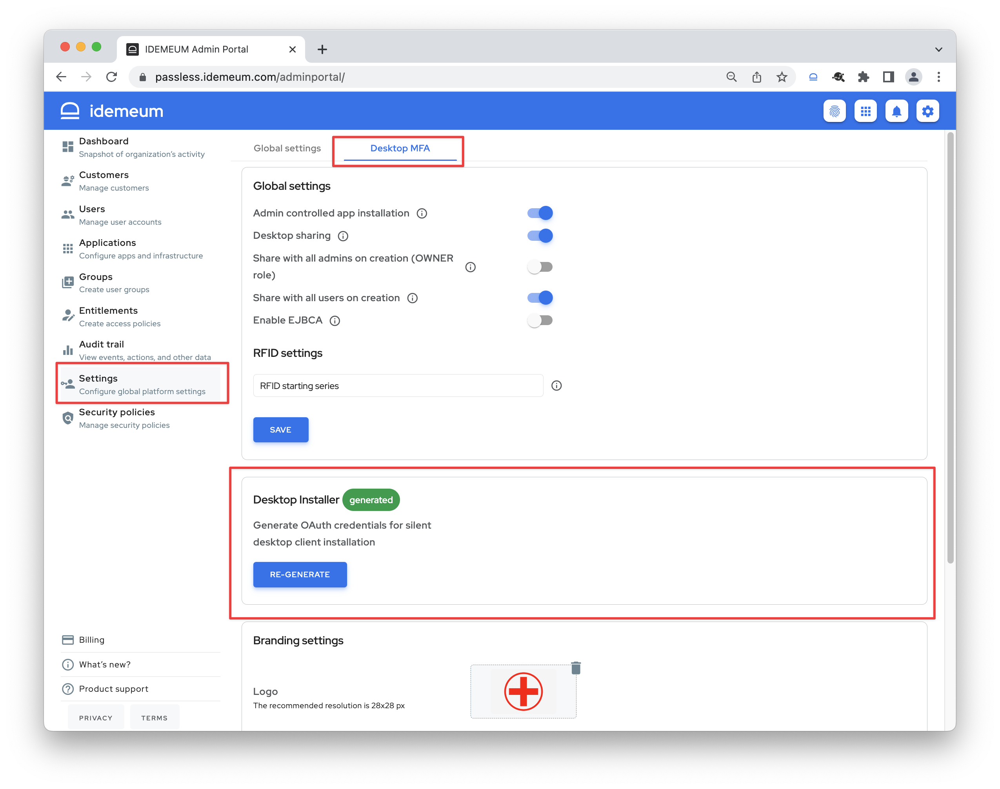
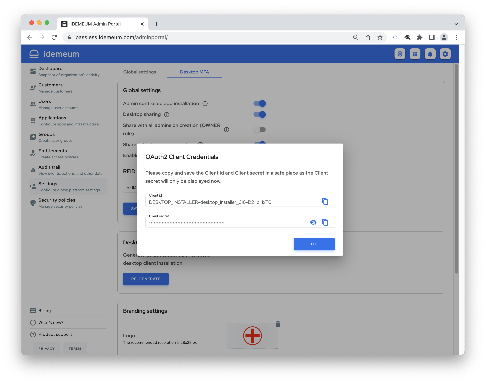

# RFID silent installation

## Overview

Today you can install idemeum desktop client manually and connect it to idemeum cloud by scanning a QR-code with your mobile device. However, when you have hundreds of shared desktops, manual installation is not practical. For that purpose idemeum offers an option to push idemeum desktop client to your workstations with a silent installation. 

The first step you would need to do is to retrive `client id` and `secret` that will be used by idemeum desktop client to connect to your cloud instance. 

* Navigate to your idemeum cloud tenant admin portal
* Access `Settings` -> `Desktop MFA`
* Scroll down to `Desktop installer`

* Click `Generate` to generate desktop client credentials

::: warning ❗ Save client credentials
Take note of these credentials as they will only be displayed once.
:::

## Silent installation options

Today we tested and verified silent installation options with the following tools. Click on the link to open the detailed guide for your desired installation option:

|Method| Description | Detailed guide
|:------|:-------------|:--------
|**PDQ Deploy** | Deploy idemeum desktop client with PDQ Deploy | [Detailed guide](https://integrations.idemeum.com/windows-desktop-mfa-silent-installer-via-pdq-deploy/)