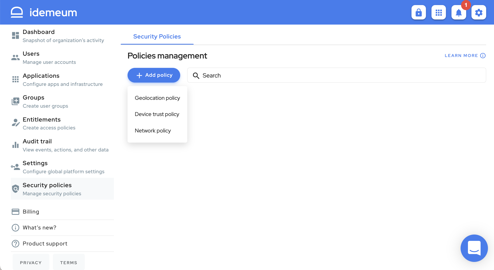

# Security Policies

## Overview
Administrators can use *Security Policies* to restrict login activity based geolocation, time and device posture attributes. Navigate to `Security Policies` to start setting up policies for your organization.

## User Association

Security Policies can be associated with [administrator defined group](./group-management.html) as well as out-of-box logical collection of users that are listed below.

| Collection  | Description                                   |
| :---        |                                          :--- |
| All Users   | Automatically includes all `Non Admin` users. |
| All Admins  | Automatically includes all `Admin` users.     |

Please note that the both collections are mutually exclusive. Users without any policy association will experience restriction free access to system.

## Geolocation Policy

Geolocation policy provide ability to restrict access specific countries and optionally define time window to futher restrict acccess to during limited hours of the day.

Geolocation policy only grants access from countries defined in the rule. Time window is optional. Access is granted for any time of the day when time window in not defined.

### Example 1

* Users accessing from `India` & `Nepal` can only access between `09:00-17:30` UTC.
* Users accessing from `United States of America` have unrestricted access during any time of the day.
* Users accessing from rest of the world will be denied access.

### Example 2

* Users accessing from `India` & `Nepal` can only access between `09:00-17:30` UTC.
* Users accessing from  rest of the world have unrestricted access during any time of the day.

## Device Trust Policy

Users subjected to a device trust policy can only use the idemeum web portal on a mobile device that has [idemeum app](./downloads.html) installed and the device meets device the requirements defined by the policy.
Policy also allows administrator to completely block a mobile platform as shown below.

