# Security white paper

[[toc]]

## Overview
This paper openly and transparently shows how we architected idemeum from the security standpoint. We have detailed all architecture designs, crypto algorithms, protocols, and approaches we took to secure data and companies that are using idemeum. 

## Platform components
Privacy and security are in our DNA, which is why idemeum's platform is built on the core principles of zero passwords, data security, data privacy, and strong cryptography.

The platform is made up of multiple secure components that demonstrate the  information security characteristics of confidentiality, integrity and availability (the [CIA triad](https://en.wikipedia.org/wiki/Information_security)). We will delve into the security aspects of each component in this paper.

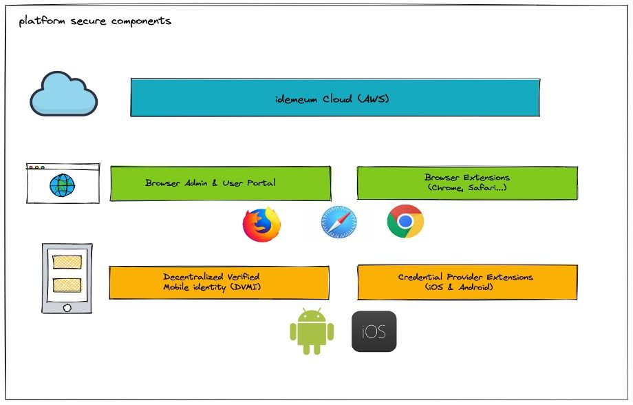

* **idemeum cloud** - our backend infrastructure, deployed on AWS.
* **Browser admin and user portal** - web applications where a user can manage and access their assigned applications.
* **Browser extension** - an extension that provides access to a user's applications and auto-fills credentials for password based applications.
* **Decentralized Verified Mobile Identity (DVMI)** - a mobile application that stores a user's digital identity secured by crypto keys and biometrics.
* **AutoFill Credential provider extensions** - Android and iOS extensions  that provide credentials for password based applications on mobile devices.

## Fundamental security principles
Our guiding security principles are:

* **100% passwordless** – idemeum eliminates passwords end to end and replaces them with biometrics and certificates instead. Even our password manager operates without a master password. All of this is made possible by the idemeum mobile app, which gives users unique and secure digital identities tied to their mobile devices.
* **Decentralized identifier (DID)** – when a user installs the idemeum mobile app, their user identifier is created and managed by hardware backed storage on a mobile device. DID assertion along with FIDO2 / UAF assertion are used to prove the user's identity in the cloud. Pubic keys are stored in the cloud, whereas private keys are stored only on the user's device.
* **End-to-end encryption** – cryptographic keys are created and managed on the user's devices (idemeum mobile app, browser). All the crypto operations are performed on the user's devices locally. This way a user's data is protected from idemeum or attackers that might gain access to the idemeum cloud.
* **Zero-knowledge cloud** – the idemeum cloud does not have any knowledge of a user's crypto private keys. As a result, we can never see sensitive data belonging to a user.
* **Multiple encryptions during data transmission** – all data that is transmitted from a user's idemeum app to the browser is encrypted multiple times; being authenticated by both transport layer security (TLS) and the user-managed transit symmetric and asymmetric cryptography keys that are transient in nature.
* **Secure identity recovery** – each user gets a cryptographically-backed one time recovery key (stored as a QR code) that allows them to recover their mobile identity (DID) in the event that their device is lost.

## Security of idemeum mobile app (DVMI)

### How the decentralized user identifier (DID) is created
When users install and set up the idemeum mobile app, they are effectively creating a digital identity on a mobile device that they can then present to a service provider (employer or application). Each user is assigned a decentralized identifier (DID) that globally represents their digital identity to service providers.

We apply the following strict security compliance steps before creating the decentralized identifier (DID) on the user's idemeum app.

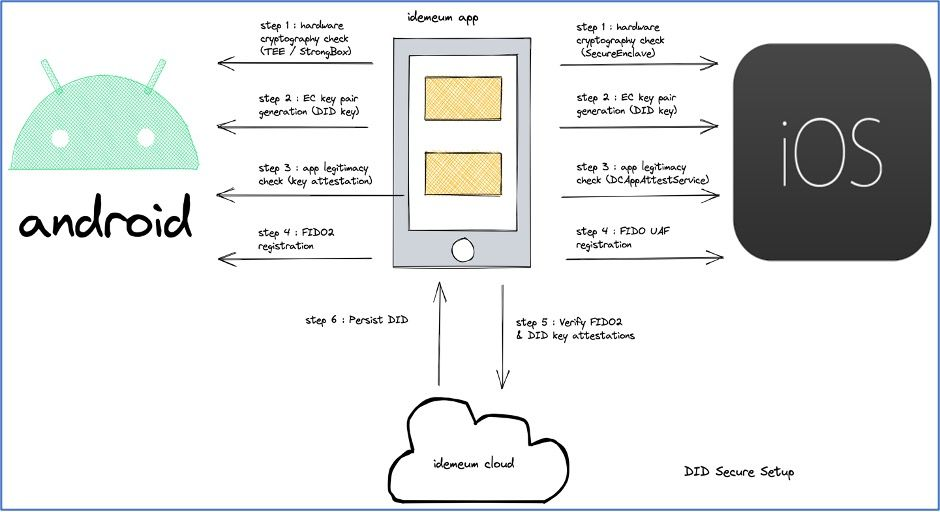

* **Step 1:** Check if the device supports hardware backed cryptography key material. For Android, we check if the key material of the android keystore system can be bound to secure hardware ([TEE](https://developer.android.com/training/articles/keystore)) or dedicated hardware security model (StrongBox). Similarly for iOS, we check for [Secure Enclave support](https://support.apple.com/guide/security/secure-enclave-sec59b0b31ff/web), hardware-based key manager that’s isolated from the main processor to provide an extra layer of security backed key material.
* **Step 2:** Create elliptic curve key-pair using the ECC_NIST_P256 (secp256r1) algorithm for verifying cryptographic signatures created for the DID. In this paper, we will refer to this hardware backed key-pair as the **DID key**.
* **Step 3:** Assert the legitimacy of a particular instance of the idemeum app to the idemeum cloud. In Android, [key attestation](https://developer.android.com/training/articles/security-key-attestation) is used to verify hardware backed DID key and to check if the idemeum app is allowed to use the secret DID key material under attestation. For iOS, we leverage the [DCAppAttestService](https://developer.apple.com/documentation/devicecheck/dcappattestservice) from the DeviceCheck framework to validate the instance of the idemeum app running on a user's device.
* **Step 4:** Prompt the user to register biometrics using the FIDO2 WebAuthn specification on the Android and the FIDO UAF specification on iOS platform. The idemeum app receives the [attestation](https://www.w3.org/TR/webauthn-1/#sctn-attestation) after the biometric [registration](https://fidoalliance.org/specs/fido-uaf-v1.2-rd-20171128/fido-uaf-protocol-v1.2-rd-20171128.html#registration) is completed.
* **Step 5:** the idemeum app collects both the FIDO2 / UAF attestation and the hardware backed DID key attestation and sends them to the idemeum cloud for verification.
* **Step 6:** On successful verification of both the attestations, the idemeum cloud saves the FIDO and DID public keys and creates a decentralized identifier for the user. The created DID is persisted on the user's idemeum app for all future interactions.

### How identity claims are verified and securely stored
A user's digital identity consists a set of claims where each claim is a piece of personally identifiable information. After the user is assigned a DID as explained in the previous section, the user can digitally verify their identity claims like email and phone number using OTP and SMS. A user can also verify their government issued ID, like a passport or driver’s license, by scanning the physical ID. The app then performs liveness detection check. The first name, last name, address, and DOB claims are then retrieved from the verified document. This set of user claims (personally identifiable information) are then securely persisted in the idemeum app and are not shared or saved on the idemeum cloud. The following steps are performed to secure the claims on the user's mobile app:

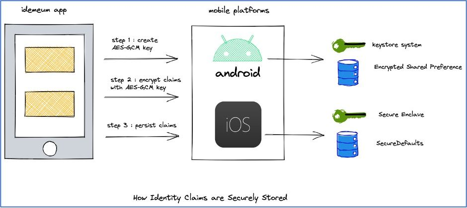

* **Step 1:** Create a AES-GCM (Advanced Encryption Standard (AES) algorithm in Galois/Counter Mode (GCM)) 256-bit encryption key. The length of the initialization vector (IV) is always 12 bytes. The key material is bound to the secure hardware and never enters the idemeum app's process memory.
* **Step 2:** Encrypt all the user claims using the AES-GCM symmetric key material. We use two levels of encryption before storing the claims in the storage. The first-level of encryption is done by the hardware backed AES-GCM symmetric key and the second-level is inherently achieved by the storage implementation.
* **Step 3:** The encrypted claims are persisted in the device's secure storage. In Android, we use the [Encrypted Shared Preference](https://developer.android.com/reference/androidx/security/crypto/EncryptedSharedPreferences) class that performs the second-level of encryption. In iOS, we use the [SecureDefaults](https://github.com/vpeschenkov/SecureDefaults) wrapper over UserDefaults that comes with an extra AES 256-bit encryption key.

### Passwordless login flow
On successful setup of the idemeum mobile app (digital identity (DVMI)), a user can login to their company's idemeum portal (either directly or through the browser extension) to access their entitled applications. The login flow is initiated by showing the QR code or sending a notification to the user's mobile app. The following steps are performed to securely approve a login with the set of requested claims.

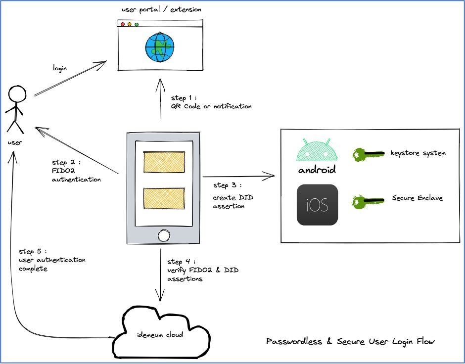

* **Step 1:** The idemeum app scans the QR Code or parses the notification and displays the approval page with the claims requested by the website (i.e. email, mobile number, etc).
* **Step 2:** If the user chooses to approve this login request, the user is prompted for FIDO2 / UAF biometric authentication. We validate that the user that has setup the digital identity is the same user that is performing the biometric authentication. This is done to protect against multiple biometric registrations on the mobile device. The FIDO2 / UAF returns a cryptography signed assertion to the idemeum app.
* **Step 3:** The idemeum app then creates a DID key assertion which is cryptographically signed using the hardware backed key material. Both the FIDO2 / UAF assertion and the DID assertion along with the requested claims are sent to the idemeum cloud.
* **Step 4:** The idemeum cloud [verifies](https://www.w3.org/TR/webauthn-1/#verifying-assertion) the [assertions](https://fidoalliance.org/specs/fido-uaf-v1.2-rd-20171128/fido-uaf-protocol-v1.2-rd-20171128.html#authentication) using the public key cryptography.
* **Step 5:** On successful verification of the assertions, the user is authenticated and given access to their company's idemeum portal or the browser extension.

### How the password manager user keys are secured
The idemeum password manager has been designed to be 100% passwordless (no master or last password), have end-to-end encryption (cryptography keys managed on the user's device), and maintain a zero-knowledge cloud (idemeum cloud does not have any knowledge of a user's crypto private keys). To achieve these goals, we take the following steps:

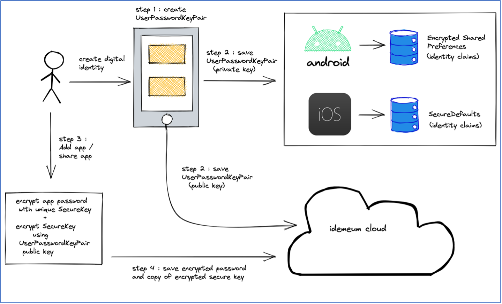

* **Step 1:** On setup of a digital identity, a user is assigned a RSA-OAEP public encryption key pair with a 2048-bit moduli and a public exponent of 65537. We will refer to this key pair as the **UserPasswordKeyPair**.
* **Step 2:** The private key of the **UserPasswordKeyPair** is represented as an identity claim in the idemeum app as explained in the [How identity claims are verified and securely stored](./security-whitepaper.md#how-identity-claims-are-verified-and-securely-stored) section. The public key of the UserPasswordKeyPair is saved on the idemeum cloud.
* **Step 3:** When a user adds a password application or someone shares an application with a user in the user portal, browser extension, or mobile app, the password of the application is encrypted using a symmetric key (**SecureKey**, explained in the web browser section later in the paper).  A copy of the **SecureKey** is then encrypted using the public key of the **UserPasswordKeyPair**. All the crypto operations are performed on the user's local device (i.e. browser, android, or iOS).
* **Step 4:** The encrypted user copy of the **SecureKey** is saved on the cloud and can only be decrypted by the private key of the **UserPasswordKeyPair** that resides on the user's mobile device. This gives us a zero-knowledge cloud, because idemeum is not aware of the user's private key. The encrypted password of the application is then saved in the idemeum cloud.
* **Step 5:**  In order to achieve an optimal user experience without compromising security during the login flow, the **UserPasswordKeyPair's** private key is transmitted with multiple levels of encryption from the user's mobile app to the browser. The browser then uses this key to decrypt the user's copy of the **SecureKey** that in turn can decrypt the password of the application. We will cover the transport security of this key in next section.

### Securing password manager user key in transit
As explained in the previous section, in order for the user's browser to be able to use an app's password, it needs to be decrypted. Passwords are encrypted with symmetric **SecureKey** (unique to each app) which is then encrypted with the **UserPasswordKeyPair's** public key. Only the **UserPasswordKeyPair's** private key, which resides on the user's idemeum mobile app can decrypt the user copy of the **SecureKey** which can in turn decrypt the password of the app. idemeum performs the following steps to achieve multiple levels of encryption for data in-transit.

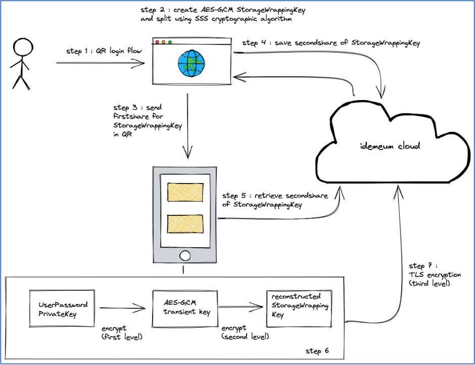

* **Step 1:**  User login using QR code in the User Portal or extension.
* **Step 2:** Create a AES-GCM 256-bit encryption key and will call it **StorageWrappingKey** for reference in this paper. The **StorageWrappingKey** is split using Shamir’s Secret Sharing (SSS) cryptographic algorithm into two shares with threshold (minimum number of shares required to reconstruct **StorageWrappingKey**) set to number of splits.  .
* **Step 3:** The first share of **StorageWrappingKey** is embedded in the QR code and is delivered to the user's idemeum app.
* **Step 4:** The second share of **StorageWrappingKey** is saved on the cloud and is associated with sign-in challenge that is transient in nature.
* **Step 5:** The login approval flow in idemeum app retrieves the second share of from the cloud and reconstructs **StorageWrappingKey**.
* **Step 6:** The idemeum app creates a new transient symmetric AES-GCM 256-bit encryption key and encrypts the user private key of the **UserPasswordKeyPair** (first level of encryption) with the transient key. The encrypted user private key is then encrypted again (second level of encryption) with the reconstructed **StorageWrappingKey**.
* **Step 7:** Finally, the encrypted data is sent over transport layer encryption (TLS) which is third level of encryption.

### Decentralized identifier recovery

[Decentralized identifier (DID)](https://www.w3.org/TR/did-core/) recovery is a fundamental aspect of idemeum's digital identity model and can be triggered when a user's mobile device is lost or changed. There are certain tradeoffs that the user needs to be aware of when DID recovery is triggered.

#### What can we recover?
* We can recover the unique DID that was assigned when the user first setup their digital identity.
* We can recover all of a user's entitled apps (Single Sign-on, Password apps).
* The user will be able to use single sign-on into SAML and Password apps just like before. This means we will recover and re-encrypt password based app credentials locally on the new device.
* User does not need to be provisioned / de-provisioned in the integrated 3rd Party apps.

#### What can we not recover?
* We cannot recover the user's biometrics that were setup on the previous device. We rely on FIDO2 specifications, and it is not possible to export biometrics from a previous device. Honestly, this is also against our principles of data security, data privacy and strong cryptography.
* We will not be able to recover verified identity claims like email, phone number, ID document parsed first name, last name… The user will have to re-verify the claims on a recovered device.

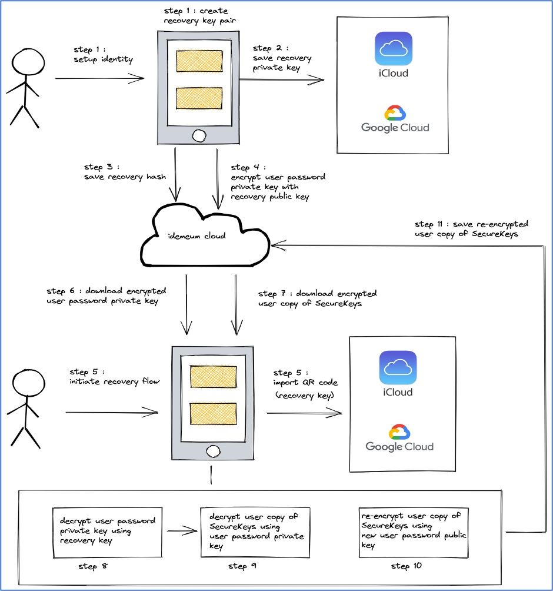

* **Step 1:** When a user sets up the idemeum mobile app, they are assigned an RSA-OAEP key pair with 2048-bit moduli and a public exponent of 65537. We will refer this as the **UserRecoveryKeyPair** for reference in this paper.
* **Step 2:**  The user is given a QR code and then prompted to either export it (to their iCloud / Google drive) or download and save it in a secure location. The QR code contains a compressed version of the recovery private key of **UserRecoveryKeyPair**, also called the **recovery key**.
* **Step 3:** A hash of the recovery key is saved on the idemeum cloud.
* **Step 4:** In order to be able to recover password apps, the private key of the **UserPasswordKeyPair** (refer to [How password manager user keys are secured](./security-whitepaper.md#how-identity-claims-are-verified-and-securely-stored) section) is encrypted with the recovery public key of **UserRecoveryKeyPair** and saved on the cloud. This will help us to recover the password manager apps that are secured using the **UserPasswordKeyPair**.
* **Step 5:** On start of recovery flow, the first thing the user can either scan or import their saved QR code. idemeum app computes the hash of the recovery key and checks if the hash exists on the cloud. If it does, the user is assigned the DID that was previously associated with this hash.
* **Step 6:** The encrypted private key of the **UserPasswordKeyPair** is downloaded from the cloud.
* **Step 7:** A copy of the encrypted **SecureKeys** is downloaded for all password apps assigned to a user in the cloud. These credentials were originally encrypted with public key of the **UserPasswordKeyPair**.
* **Step 8:** Decrypt the private key of the **UserPasswordKeyPair** using the recovery key (Step 5).
* **Step 9:** Decrypt the user's copy of the encrypted SecureKeys using the decrypted private key of the **UserPasswordKeyPair** (Step 8).
* **Step 10:** Re-encrypt the user's copy of the **SecureKeys** with the new user public key of **UserPasswordKeyPair** for all of a user's assigned apps.
* **Step 11:** For each app assigned to a user, save it's re-encrypted **SecureKeys** for this user in the cloud.

## Web security

### How password manager operations are secured in the browser and browser extension
idemeum's password manager has been designed to be 100% passwordless, use end-to-end encrypted, and maintain a zero-knowledge cloud. We have covered the functioning of the password manager on the user device in the [How password manager user keys are secured](./security-whitepaper.md#how-the-password-manager-user-keys-are-secured) and [Securing password manager user key in transit](./security-whitepaper.md#securing-password-manager-user-key-in-transit) sections. These sections lay the foundation of the idemeum password manager's capabilities for the browser user portal and browser extension.

In this section, we will dive into the details of the password manager operations on the user portal and browser extension. We support the following password manager operations in the user portal and browser extension:

* Add / Update / Delete password app
* Share / Un-share password app with other users
* View Password in cleartext or copy to clipboard
* Launch (open) password app with autofill of credentials
* Auto-capture credentials on certified websites and create a password app

We perform the following steps to secure the operations on the browser and extension:

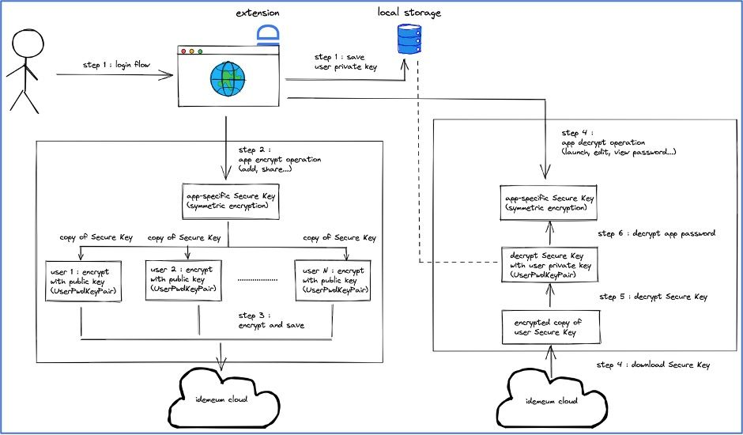

* **Step 1:** On successful user login, the private key of the **UserPasswordKeyPair** is securely transmitted from the user's idemeum app to the browser with multiple levels of encryption. This is explained in the [Securing password manager user key in transit](./security-whitepaper.md#securing-password-manager-user-key-in-transit) section. The private key is decrypted locally and is securely persisted as explained in [How password manager user key is secured in client storage at rest](./security-whitepaper.md#how-password-manager-user-key-is-secured-in-client-storage-at-rest) later.
* **Step 2:** For all the password manager operations listed above, the credentials are encrypted using an AES-GCM (Advanced Encryption Standard (AES) algorithm in Galois/Counter Mode (GCM)) 256-bit encryption key. We will refer to this as the **SecureKey** for reference in this paper. The **SecureKey** is never persisted on the client or on the cloud.
* **Step 3:** Every password app is assigned a separate unique **SecureKey**. When an app is added by a user or shared with a user, a copy of the **SecureKey** is encrypted with the public key of the **UserPasswordKeyPair** and saved on the cloud in the app context.
* **Step 4:** For operations that require a password to be decrypted (edit, view password, launch app, share), we first download the encrypted copy of the **SecureKey** for the user from the cloud to the browser or extension.
* **Step 5:** The downloaded encrypted copy of the **SecureKey** is decrypted with the user private key that was fetched from the user device and saved in local storage.
* **Step 6:** Using the decrypted **SecureKey**, we will decrypt the password and perform any desired operations in the browser or extension.
* **Step 7:** Data maintained in the local storage is valid for the user session and is cleared when user logs out or the session expires.

### How password manager user key is secured in client storage at rest

On successful user login, the private key of the **UserPasswordKeyPair** is securely transmitted from the user's idemeum app to the browser using multiple levels of encryption. On the browser end, we perform multiple levels of decryption and then manage the decrypted user private key for the user session. The user private key is saved in memory and securely persisted in the local storage using [Shamir’s Secret Sharing (SSS)](https://en.wikipedia.org/wiki/Shamir%27s_Secret_Sharing) cryptographic algorithm.

How does secure storage work?

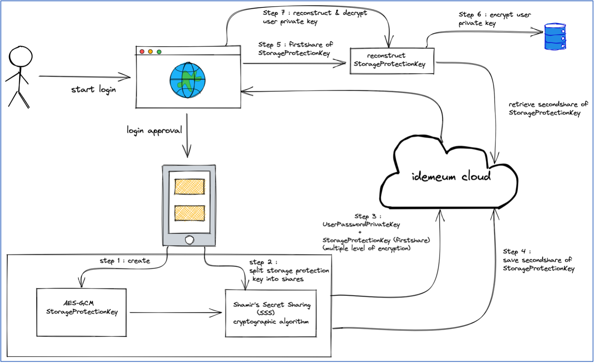

* **Step 1:** In the login approval flow, the idemeum app creates an AES-GCM (Advanced Encryption Standard (AES) algorithm in Galois/Counter Mode (GCM)) 256-bit encryption key. In this paper, we will refer this symmetric key as the **StorageProtectionKey**.
* **Step 2:** Using the Shamir’s Secret Sharing (SSS) cryptographic algorithm, **StorageProtectionKey** is split into two shares with threshold (minimum number of shares required to reconstruct the **StorageProtectionKey**) set to number of splits.
* **Step 3:** The first share of the **StorageProtectionKey** is transmitted along with the **UserPasswordPrivateKey** in multiple levels of encryption scheme as explained earlier in the [Securing password manager user key in transit](./security-whitepaper.md#securing-password-manager-user-key-in-transit) section.
* **Step 4:** The second share of the **StorageProtectionKey** is saved on the cloud along with the user session (JTI) that will be valid until the user session expiration or logout.
* **Step 5:** The browser client reconstructs the **StorageProtectionKey** through multiple levels of decryption using the first share received from the user's idemeum app and by retrieving the second share from the cloud using an authenticated session.
* **Step 6:** The reconstructed symmetric AES-GCM **StorageProtectionKey** is used to encrypt the user private key. The encrypted user private key is persisted in the local storage along with first share of the StorageProtectionKey.
* **Step 7:** During the user session, if the in-memory user private key is not found due to extension clearing the memory state, we will reconstruct the StorageProtectionKey using first share from the local storage and second share from the cloud. The reconstructed StorageProtectionKey will be used to decrypt the user private key saved in the browser's local storage.

By performing the above procedure, the encrypted user private key cannot be decrypted until both the shares of the **StorageProtectionKey** can be cryptographically joined, which means attacker will require access to the local storage and biometric approved authenticated session.

### How JSON Web Token's are secured

JSON Web Token (JWT) is an open standard ([RFC 7519](https://tools.ietf.org/html/rfc7519)) that defines a compact and self-contained way for securely transmitting information between parties as a JSON object. This information can be verified and trusted because it is digitally signed.

* **Step 1:** As part of a tenant's setup in the idemeum cloud, an elliptic curve key pair is generated using ECC_NIST_P256 (secp256r1) algorithm which is referred as tenant JWT key in this paper.
* **Step 2:** During the user login flow, idemeum cloud issues signed JWT's as session tokens using the tenant's JWT private key. All session tokens are issued within a tenant-context, if a user is logged into multiple tenants each session is guarded by a separate tenant JWT to prevent cross-tenant resource access for a valid user session (i.e., sessions issued to tenant1, cannot be used for tenant2).
	* Each JWT token payload consists of registered claims, refer to [IANA Registered claims](https://www.iana.org/assignments/jwt/jwt.xhtml#claims):
		* iss: Identifies the principal that issued the JWT
		* aud: Identifies the recipients that the JWT is intended for
		* sub: Identifies the principal that is the subject of the JWT, in our case it is user dvmi id
		* exp: The expiration time of the token in seconds since January 1, 1970, UTC (Unix time)
		* iat: The issuing time of the token in seconds since January 1, 1970, UTC (Unix time)
		* jti: Unique identifier of the Token
		
JWT example:

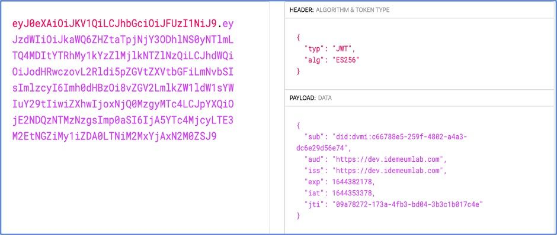

* **Step 3:** When a user tries to access idemeum cloud resources, their browser presents the idemeum session token to the cloud. The cloud verifies the token using the tenant JWT public keys as follows:
	* The signature of JWT is validates using the tenant JWT public key to ensure that the token is issued using the tenant JWT private key only.
	* The expiration of JWT token is validated
	* The issuer of JWT token is matched as part of incoming request domain name to ensure that user cannot access resources from token issued from another tenant domain.
* **Step 4:** the idemeum cloud issues two additional JWT tokens signed by the corresponding tenant JWT key to facilitate identifying the user and enforcing the authorization checks:
	* DVMI_ID cookie issued as a signed JWT, used to send the notification to user's device.
	* Session Token cookie issued as a signed JWT, used to enforce the authorization checks when the user interacts with user or admin portal.
	
### Protecting against Cross Site Request Forgery
Cross-Site Request Forgery (CSRF) is an attack that forces an end user to execute unwanted actions on a web application in which they’re currently authenticated. With a little help from social engineering (such as sending a link via email or chat), an attacker may trick the users of a web application into executing actions of the attacker’s choosing. If the victim is a normal user, a successful CSRF attack can force the user to perform state changing requests like transferring funds, changing their email address, and so forth. If the victim is administrator, CSRF can compromise the entire web application.

idemeum cloud guards against CSRF for the login flow (when the user is not authenticated) and post login flow (when the has a valid session).

#### Login flow
The idemeum cloud makes use of the synchronous token pattern to guard the login flow. We issue a token per login flow to avoid replay attacks. For more details on synchronous token pattern please refer to [following page](https://cheatsheetseries.owasp.org/cheatsheets/Cross-Site_Request_Forgery_Prevention_Cheat_Sheet.html#synchronizer-token-pattern).

For more details on login flow please refer to the above section [Passwordless Login Flow](./security-whitepaper.md#passwordless-login-flow).

* **Step 1:** During the start of login flow the idemeum cloud generates the cryptographically strong pseudorandom value known as a CSRF token on server and passes this as hidden parameter to the login html page.
* **Step 2:** The browser makes an ajax call to get the sign-in challenge (which will be fulfilled by DVMI app asynchronously either by scanning the QR code or responding to the notification), including the CSRF token as a custom header (**x-idemeum-csrf-login-token**).
* **Step 3:** The idemeum cloud validates the CSRF token to ensure that the sign-in request came from the same browser which initiated the login flow by matching the CSRF token issued during the login flow.
* **Step 4:** The browser polls for a sign-in complete response, passing the CSRF token.
* **Step 5:** The idemeum cloud validates the CSRF token and upon successful login completion it issues the session token, redirects the browser to destination along with clearing the CSRF token state to prevent the replay attack.

#### Post login flow
Upon successful login the user is redirected to either the user portal or admin portal to access resources i.e., launch applications, or configure tenant resources (admin user). The idemeum cloud makes use of the [double submit cookie technique](https://cheatsheetseries.owasp.org/cheatsheets/Cross-Site_Request_Forgery_Prevention_Cheat_Sheet.html#double-submit-cookie) to prevent CSRF attack post login.

* **Step 1:** Upon successful login when the user gets redirected to either the admin or user portal, the idemeum cloud generates a cryptographically strong pseudorandom value (set as a hidden parameter) known as the CSRF token. The CSRF cookie is generated using the JWT token (signed by tenant JWT private key).
	* CSRF JWT token payload
		* **sub**: The subject is populated with the CSRF token generated and passed as hidden parameter
		* **iat**: The issuing time of the token in seconds since January 1, 1970, UTC (Unix time)
		* **jti**: JTI of session token to
		
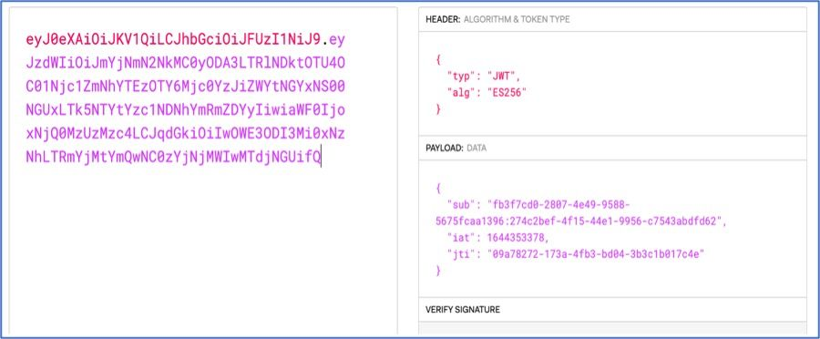

* **Step 2:** The browser sends the CSRF cookie as part of every request to idemeum cloud and sends the CSRF token received in step 1 as custom header (**x-idemeum-csrf-token**).
* **Step 3:** The idemeum cloud validates the CSRF cookie token by applying the following checks:
	* Validate the signature of CSRF cookie token using the tenant JWT public key.
	* Validate the CSRF cookie token to ensure it is associated with the current authenticated session by matching the JTI value of the session token and the CSRF cookie token, this is done to prevent a malicious user from reusing the CSRF token issued for some other user's session or an old user session within the same tenant.
	* Validate the custom header (**x-idemeum-csrf-token**) matches with the sub claim in the CSRF cookie token.
	
## Random number generation
In idemeum, all keys generated by the client use Cryptographically Secure Pseudo-Random number Generator (CSPRNG). The password generation scheme is also built upon CSPRNG to auto suggest strong passwords.

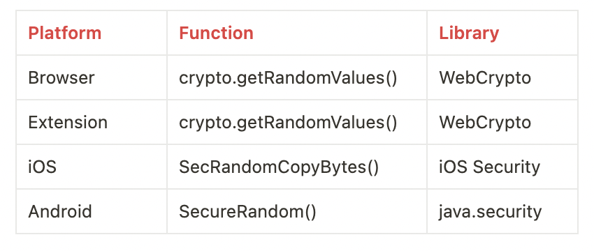

If you have any questions or suggestions please [let us know](mailto:support@idemeum.com).
