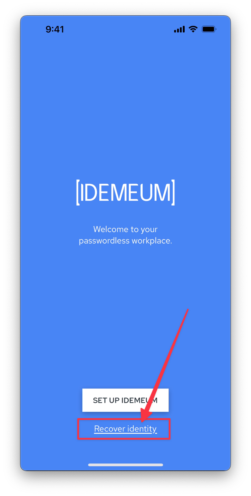

# Self service user recovery

## Overview

With this option users can self-recover access to company resources without disruption and any admin involvement required.

Upon setting up idemeum app for the first time, users are asked to store a **recovery QR-code**. This code is the key to recovery process, as it is utilized in crypto operations to restore user personal information. When recovery is needed (device is lost or stolen) users can leverage recovery QR-code to gain access to all company resources again.

Here is the high level overview of recovery process.

## User experience

### How users get recovery QR-code

When idemeum is installed on a mobile device for the first time, user verifies identity, and then user is presented with an option to store a recovery QR-code.

::: warning Keep QR-code safe

This recovery QR-code is the key to all user applications and passwords. It needs to be securely stored and not shared with anyone. For added security recovery QR-code is one-time use only. Once code is used and device is recovered, a new recovery code is generated for the user to store.

:::

User has two options:

* **Download QR-code** - the code will be saved to phone photo gallery.We recommend to print the recovery QR code and save it in the secure location.
* **Save to cloud storage** - for added convenience we offer the option to store recovery QR-code to cloud storage (Google Drive on Android, and iCloud Drive on iOS). With this option user will need to enter cloud storage credentials, and the QR code will be saved to secure app-specific location.

::: tip 

If for some reason user did not save or lost recovery QR-code after initial installation, he can always access it in `Settings` -> `Recovery code` menu.

:::

### Recovery process

* When recovery is needed, user installs a new instance of idemeum application and initiates a `Recover identity` process form the welcome page.

* Then user will choose the option to recover with QR-code

* User will be asked to either **Scan QR code** or **automatically recover identity from cloud storage**.

* User will then enable biometrics and verify email address and phone number.
* Once the process is complete, user will navigate to company portal, login and all access to company resources will be restored.

## Self-service recovery demo

<iframe src="https://www.loom.com/embed/055882804ba14f9f9812d61583192898" frameborder="0" webkitallowfullscreen mozallowfullscreen allowfullscreen style="position: absolute; top: 0; left: 0; width: 100%; height: 100%;"></iframe>

