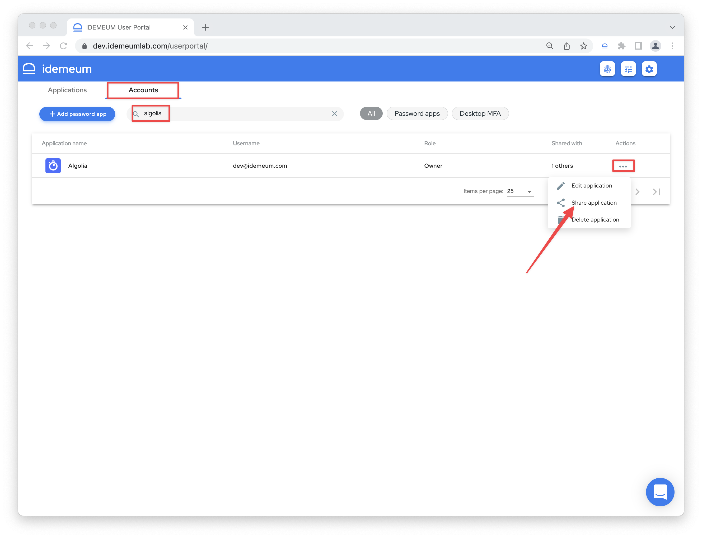
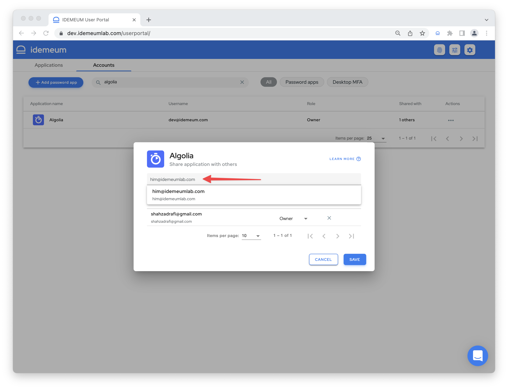
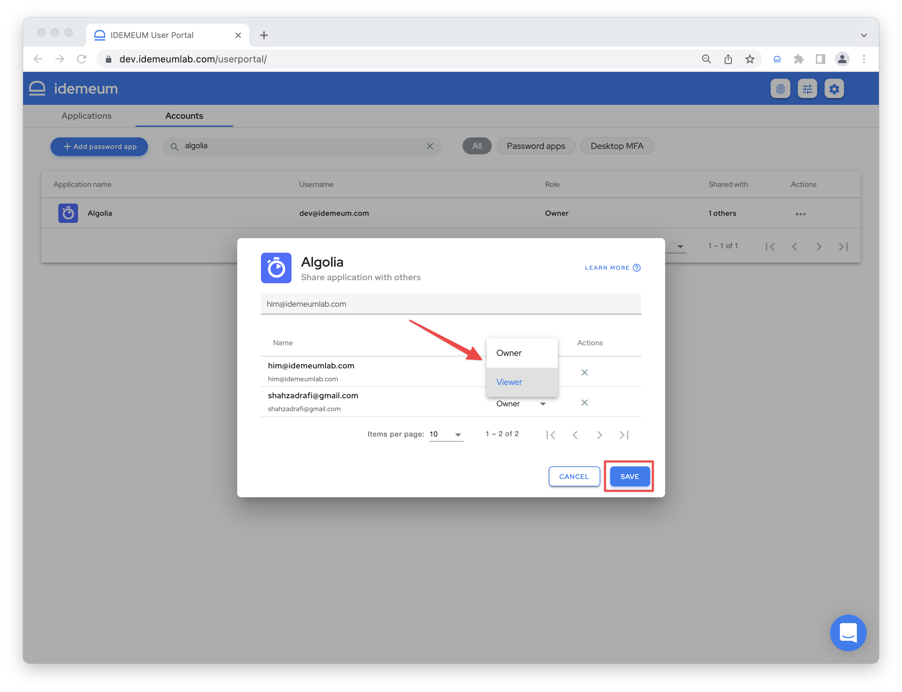

# Share passwords

## Overview

idemeum offers a convenient and secure way to share passwords with other employees. Instead of sending passwords over email / slack, or simply putting them into work documents, idemeum offers one-click password sharing functionality.

Today sharing functionality is available in the desktop portal only. 

## Share password app using desktop portal

* Login to idemeum application portal by navigating to your company URL, for example `company.idemeum.com`
* Navigate to `Accounts` tab
* Search for an application you want to share with other employees
* Click on `...` in the `Actions` section and choose `Share application`

* Search for the email address of a person that you want to share the application with

* Choose the role to assign to an employee

::: tip Roles overview

Here is what each role can do with a shared application.

|                   | View | Edit  |Delete  | Share  |
| ----------------- |:-------------:| -----------------:|-------------------:| ------:|
| Viewer    | Yes           | -               |-                 | - |
| Owner | Yes           |   Yes               |  Yes                 | Yes |

:::

* Once role is assigned, click `Save`
* The application will immediately show up in the target user's mobile and desktop catalogs