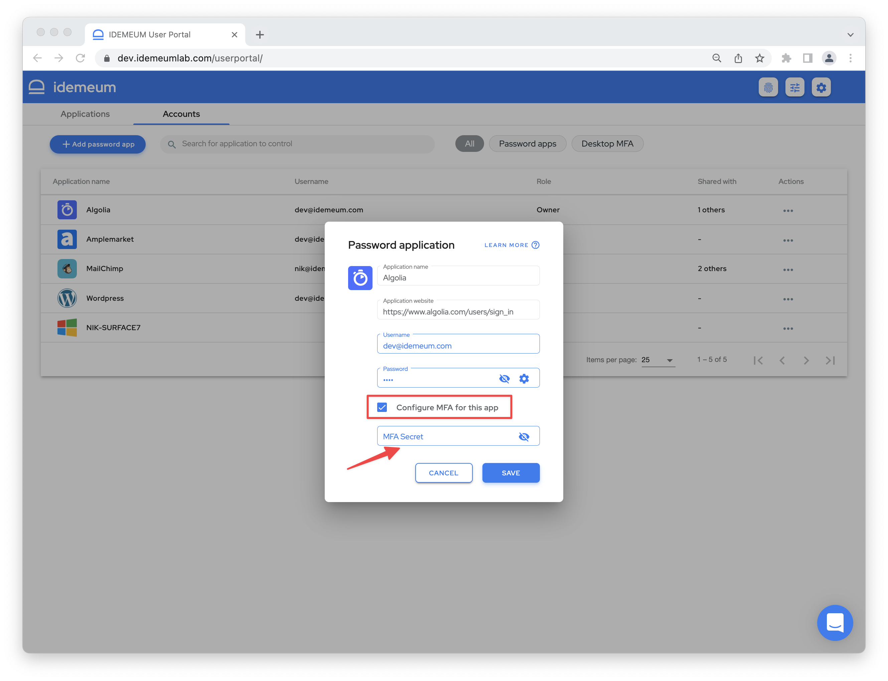
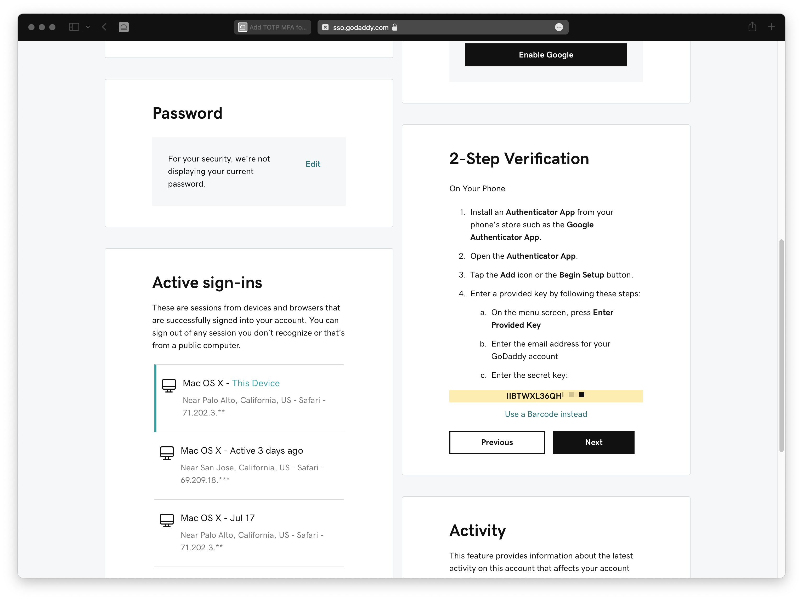
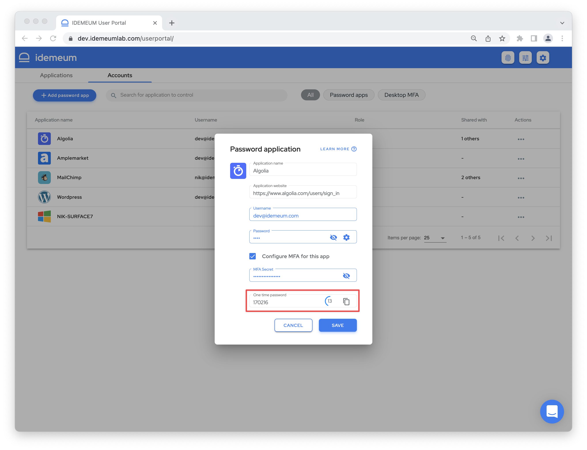
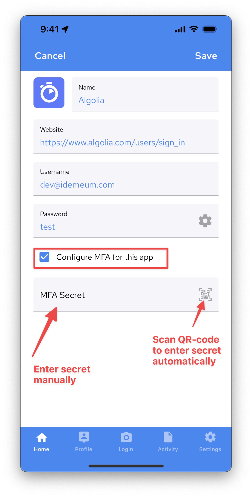

# Add TOTP MFA for password application

[[toc]]

## Overview

One-time codes provide additional level of security for password applications. When you login with username and password, you will be asked to input a one-time code to get application access. The code can only be used one time and expires every 30 seconds. idemeum offers a feature to store your one-time codes along with usernames and passwords in idemeum password vault. 

When you create an application in the browser or mobile app, you can also setup one-time code along with storing credentials. 

<iframe src='https://www.youtube.com/embed/wC0a89DRvUI' frameborder='0' allowfullscreen></iframe>

## Set up using desktop application portal

You can set up one-time code for your application when are [creating a new application](./create-password-application.html), or when you are [editing an existing one](./edit-password-application.html). 

* Login to idemeum application portal by navigating to your company URL, for example `company.idemeum.com`
* Navigate to `Accounts` tab
* Search for an application you want to edit in the application table
* Click on `...` in the `Actions` section and choose `Edit application`

* Check the box `Configure MFA for this app`
* Enter the TOTP MFA secret that your application provides. For example, here is how the secret looks like when you configure it for Godaddy

::: warning Secret or QR-code for TOTP

Typically you will be presented with a QR-code to scan when you are adding a TOTP MFA for web application.

* When you create or edit password application using **idemeum mobile app**, you can use the camera to scan TOTP QR-code. 
* When you create or edit password application using **desktop browser**, you have to switch to secret code and copy paste it into idemeum portal.

For example, in the image above QR-code was displayed first, but then we switched to secret using "Unable to scan the barcode"

:::

* Once you enter the secret code, you will be displayed a one-time password that will be expiring and automatically regenerating every 30 seconds. 

* You will then be asked to enter this one-time code into an application to confirm setup. 
* You can now save your application. 

## Set up using mobile application

* Open your idemeum mobile application
* Choose the application your want to set up TOTP for. This can be a new or existing application. 
* Click `...` and then `Edit`

* Check the box `Configure MFA for this app`
* You can now enter TOTP secret manually, or click on the `QR-code` icon to scan TOTP QR-code with your camera application. 
* Once you enter the secret code, you will be displayed a one-time password that will be expiring and automatically regenerating every 30 seconds. You will then be asked to enter this one-time password into an application to confirm setup. 
* You can now save your application. 

## One-time codes autofill

idemeum offers passwords [autofill](./autofill-passwords.html) on desktop as well as mobile browsers. 

* When you access web applications using **desktop browsers**, your credentials and one-time codes will be filled automatically. 
* When you access applications on a **mobile device**, your password will be fileld automatically, and one-time code will be automatically copied into clipboard. All you need to do it is to paste it when the application asks for it. 

