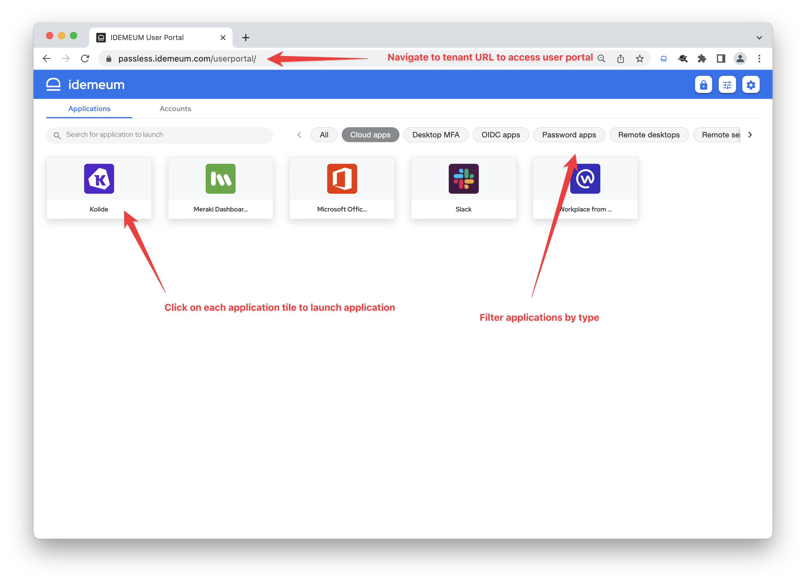
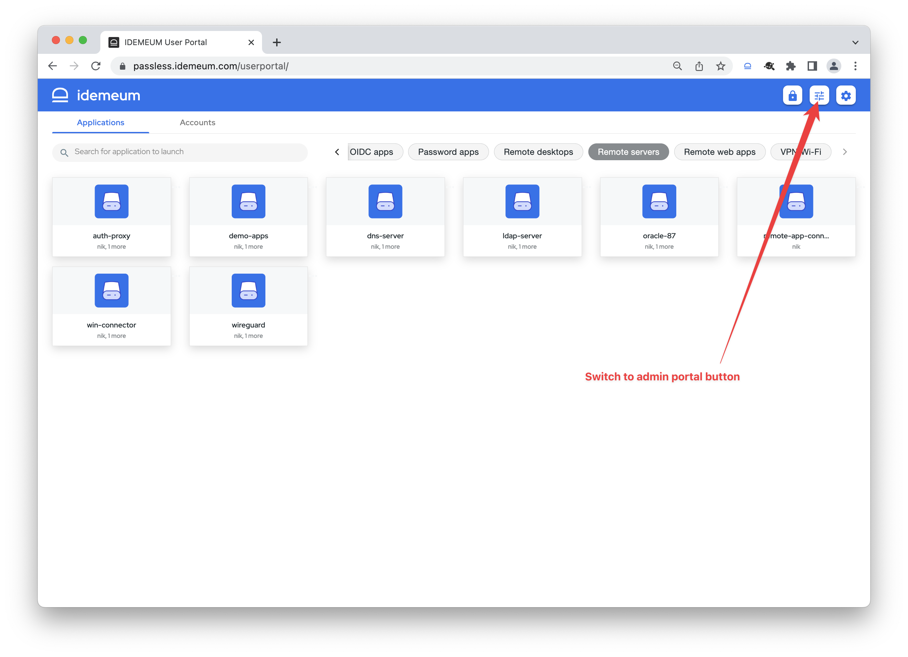
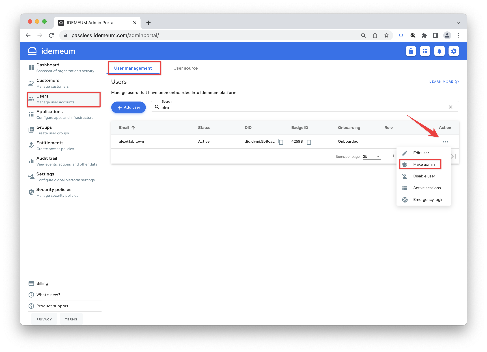

# User and admin portals

[[toc]]

## Overview
idemeum offers two cloud portals today:

1. **User portal** - portal that is accessible by all users at idemeum cloud tenant URL (i.e. `https://customer.idemeum.com`). This portal is used to access and launch all applications (SAML, password, SSH sessions, RDP desktops, and more), as well as create and manage passwords in the password vault, and share applications with other users in the organization.
2. **Admin portal** - portal that is used to manage idemeum tenant. Admins can access this portal at `https://customer.idemeum.com/adminportal`. This portal is used to manage all features of the tenant (integrations, audits, users, security policies and more.)

## Access user portal

Simply navigate to your idemeum cloud tenant URL to access idemeum user portal. 

From the user portal you can:

1. Search for applications that you have access to
2. Launch an application by clicking on the respective tile
3. Filter applications by the filter menu
4. Navigate to `Accounts` section to create or share password application
5. Switch to admin portal by clicking on the admin portal icon at the top right
6. Log out of idemeum tenant

## Access admin portal

From the admin portal you can manage all features of your idemeum tenant. 

* You can navigate to an admin portal URL directly at `https://customer.idemeum.com/adminportal`. 
* Alternatively you can access user portal and then click on the admin portal icon at the top right. 

::: tip Do not see an admin portal icon?
Switching to admin portal is only possible if you have access to it. Before you access admin portal, another admin needs to assign you an admin role so that you can manage idemeum tenant. 
:::

## Assign an admin role to a user

* Navigate to your idemeum admin portal
* Access `Users` -> `User management`
* Choose the user you want to promote to `Admin`
* Click on `...` and click `Make admin`

