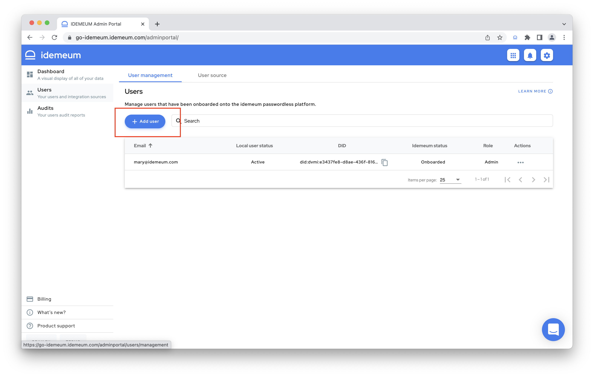
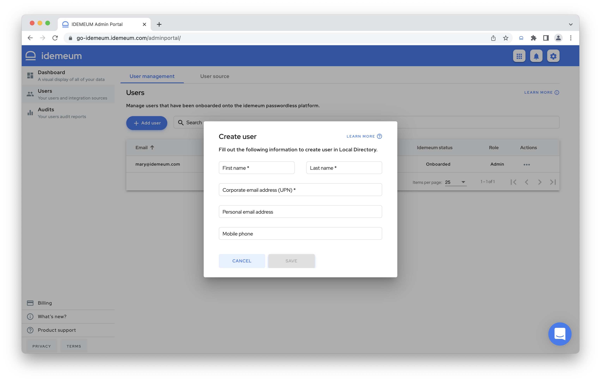
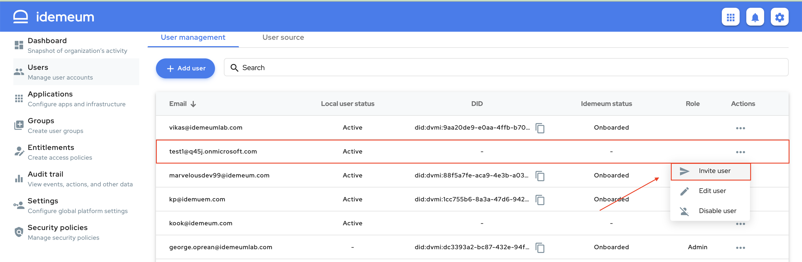
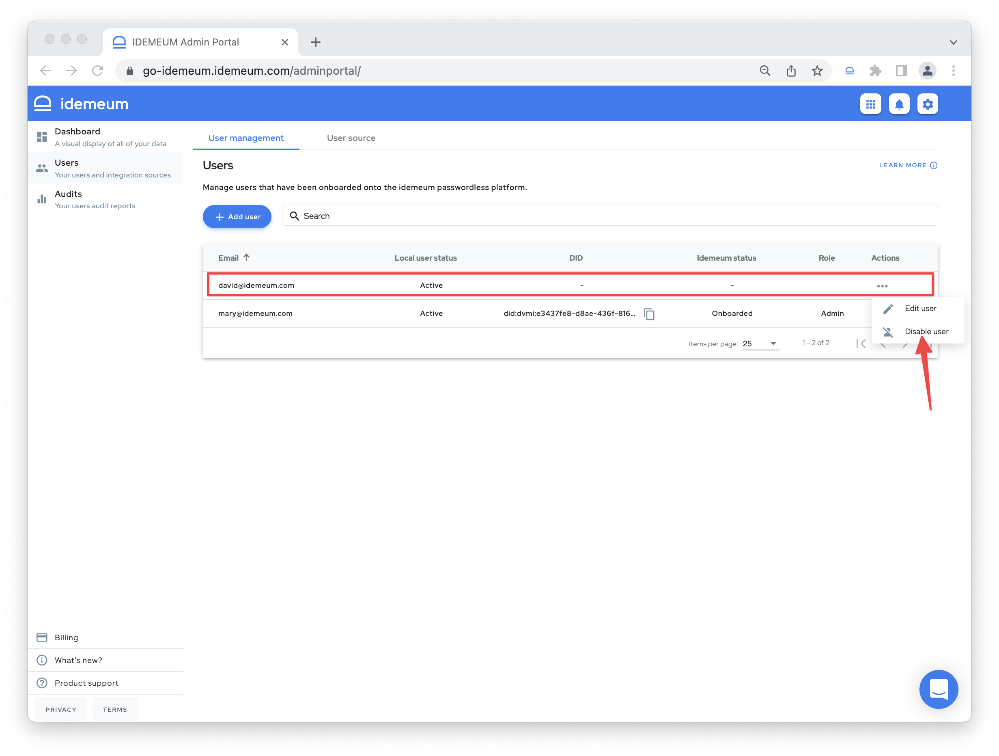
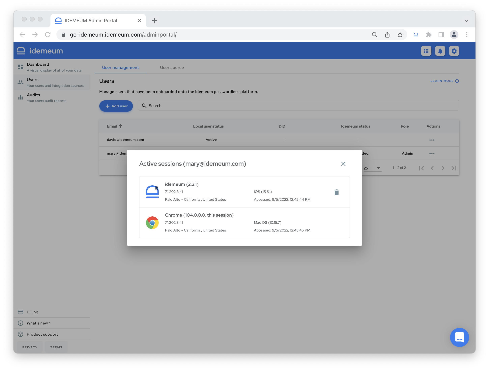

# User management

[[toc]]

## Overview
For [local user source](./integration-with-hr-system.html#local-user-source) you have full control of the user lifecycle and can **create**, **update**, and **delete** user records. For [external user source](./integration-with-hr-system.html#external-user-source) it is expected that users are managed in that external user source, and idemeum will periodically synchronize user state to reflect user changes. 

## Managing local users

### 1. Create local user

* Navigate to `Users` -> `User Management` section
* Click `Add user`

* You will now be able to create a local user record by entering user information

* You can send invitation email to users that are not onboarded yet.

::: tip Employee onboarding

Make sure you enter corporate email address as well as personal email address or personal phone number, so that [onboarding](./employee-onboarding.html) with Passwordless MFA will work for the user. 

::::

### 2. Disable local user

Before deleting idemeum allows you to disable local user first. 

* Navigate to `Users` -> `User Management` section
* Click `...` next to a user that you want to disable
* Click `Disable user`

:::warning What happens?

Once the user is disabled: 

* Access to company applications is blocked
* `Local user status` will transition from `Active` to `Disabled`.
* User can be re-enabled

To enable the user back, you repeat the procedure described above and choose `Enable user` option. 

:::

### 3. Delete local user

Once the user is disabled, you can delete user record to permanently remove user information from idemeum. 

* Navigate to `Users` -> `User Management` section
* Click `...` next to a user that you want to delete
* Click `Delete user`

::: danger What happens?

Once the user is deleted:

* Access to company applications is blocked
* User record will be permanently removed from idemeum
* Applications will be de-provisioned for the user
* User can not be re-enabled

:::

### 4. Manage local user sessions

When users access idemeum application portal using mobile or browser, a user session is created. At any given point in time there can be multiple active sessions for the user. You can view all active user sessions as well as revoke them. 

* Navigate to `Users` -> `User Management` section
* For the user that has been onboarded to idemeum click on `...`
* Click `Acive sessions`
* You will now be shows a list of active user session grouped by platform. You will see additional information such as location, platform type, OS version, and IP address. You can revoke the session by clicking on the `Trash` icon.

## Managing users from external source

When external user source is used, it is expected that users are managed in that source. idemeum will periodically synchronize with external user source to update user information.

### 1. Manage external user sessions

When users access idemeum application portal using mobile or browser, a user session is created. At any given point in time there can be multiple active sessions for the user. You can view all active user sessions as well as revoke them. 

* Navigate to `Users` -> `User Management` section
* For the user that has been onboarded to idemeum click on `...`
* Click `Acive sessions`
* You will now be shows a list of active user session grouped by platform. You will see additional information such as location, platform type, OS version, and IP address. You can revoke the session by clicking on the `Trash` icon.

